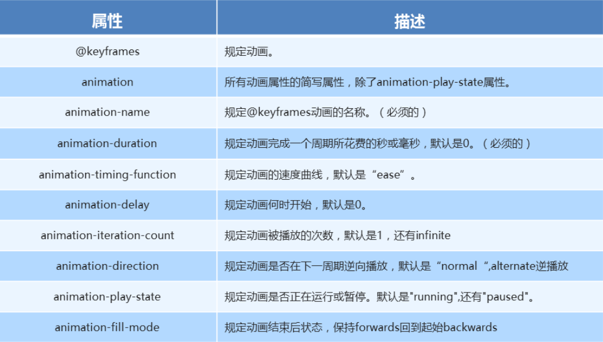

# H5C3

[TOC]


## HTML5  第一天

#### 一、什么是 `HTML5`

1. `HTML5` 的概念与定义 

   - 定义：`HTML5` 定义了 `HTML` 标准的最新版本，是对 `HTML` 的第五次重大修改，号称下一代的 `HTML` 
   - 两个概念：
     - 是一个新版本的 `HTML` 语言，定义了新的标签、特性和属性
     - 拥有一个强大的技术集，这些技术集是指： `HTML5` 、`CSS3` 、`javascript`, 这也是广义上的 `HTML5`

2. `HTML5` 拓展了哪些内容

   - 语义化标签
   - 本地存储
   - 兼容特性
   - `2D`、`3D` 
   - 动画、过渡
   - `CSS3` 特性
   - 性能与集成

3. `HTML5 ` 的现状

      绝对多数新的属性，都已经被浏览器所支持，最新版本的浏览器已经开始陆续支持最新的特性，

      总的来说：`HTML5` 已经是大势所趋


#### 二、`HTML5 ` 新增标签

 1. 什么是语义化

     就是用合理、正确的标签来展示内容，比如h1~h6定义标题。 

 2. 新增了那些语义化标签

    - `header`   ---  头部标签
    - `nav`        ---  导航标签
    - `article` ---   内容标签
    - `section` ---   块级标签
    - `aside`     ---   侧边栏标签
    - `footer`   ---   尾部标签

     

    ```html
    1、<header>
    
        <header>定义文档或者文档的部分区域的页眉，应作为介绍内容或者导航链接栏的容器。
    
        在一个文档中，您可以定义多个<header>元素，但需要注意的是<header>元素不能作为<address>、<footer> 或 <header> 元素的子元素。
    
    2、<nav>
    
        <nav>描述一个含有多个超链接的区域，该区域包含跳转到其他页面或页面内部其他部分的链接列表。
    
        在一个文档中，可定义多个<nav>元素。
    
    3、<main>
    
        <main> 定义文档的主要内容，该内容在文档中应当是独一无二的，不包含任何在文档中重复的内容，比如侧边栏，导航栏链接，版权信息，网站logo，搜索框（除非搜索框作为文档的主要功能）。
    
        需要注意的是在一个文档中不能出现多个<main>标签。
    
    4、<article>
    
        <article>元素表示文档、页面、应用或网站中的独立结构，是可独立分配的、可复用的结构，如在发布中，它可能是论坛帖子、杂志或新闻文章、博客、用户提交的评论、交互式组件，或者其他独立的内容项目。
    
        当<article>元素嵌套使用时，则该元素代表与外层元素有关的文章。例如，代表博客评论的<article>元素可嵌套在代表博客文章的<article>元素中。
    
    5、<aside>
    
        <aside> 元素表示一个和其余页面内容几乎无关的部分，被认为是独立于该内容的一部分且可以被单独的拆分出来而不会影响整体。通常表现为侧边栏或嵌入内容。
    
    6、<footer>
    
        <footer>定义最近一个章节内容或者根节点元素的页脚。一个页脚通常包含该章节作者、版权数据或者与文档相关的链接等信息。
    
        使用footer插入联系信息时，应在 footer 元素内使用 <address> 元素。
    
        注意不能包含<footer>或者<header>
    
    7、<section>
    
        <section>表示文档中的一个区域（或节），比如，内容中的一个专题组。
    
        如果元素内容可以分为几个部分的话，应该使用 <article> 而不是 <section>。
    不要把 <section> 元素作为一个普通的容器来使用，特别是当<section>仅仅是为了美化样式或方便脚本使用的时候，应使用<div>。
    
        这几个标签，比较容易混淆的是<section>、<article>，所以这里特别说明：
    
        “Authors are encouraged to use the article element instead of the section element when it would make sense to syndicate the contents of the elemen.”
        译：--如果可以联合elemen的内容，则鼓励作者使用article元素而不是section元素。
    
        通俗来说就是<article>比<section>更具有独立性、完整性。可通过该段内容脱离了所在的语境，是否完整、独立来判断。
    ```

    

    

 3. 使用语义化标签的注意

    - 语义化标签主要针对搜索引擎
    - 新标签可以使用一次或者多次
    - 在 `IE9` 浏览器中，需要把语义化标签都转换为块级元素
    - 语义化标签，在移动端支持比较友好，
    - 另外，`HTML5` 新增的了很多的语义化标签，随着课程深入，还会学习到其他的

4. 语义化优点：

    - 易于用户阅读，样式丢失的时候能让页面呈现清晰的结构。
    - 有利于SEO，搜索引擎根据标签来确定上下文和各个关键字的权重。
    - 方便其他设备解析，如盲人阅读器根据语义渲染网页
    - 有利于开发和维护，语义化更具可读性，代码更好维护，与CSS3关系更和谐。

#### 三、多媒体音频标签

​	----------chto

1. 多媒体标签有两个，分别是

   - 音频  -- `audio`
   - 视频  -- `video`

2. `audio` 标签说明

   - 可以在不使用标签的情况下，也能够原生的支持音频格式文件的播放，
   - 但是：播放格式是有限的

3. audio 支持的音频格式

   - audio 目前支持三种格式

     

   

4. audio 的参数

   ​

   

5、audio 代码演示

```css
<body>
  <!-- 注意：在 chrome 浏览器中已经禁用了 autoplay 属性 -->
  <!-- <audio src="./media/snow.mp3" controls autoplay></audio> -->

  <!-- 
    因为不同浏览器支持不同的格式，所以我们采取的方案是这个音频准备多个文件
   -->
  <audio controls>
    <source src="./media/snow.mp3" type="audio/mpeg" />
  </audio>
</body>
```

#### 四、多媒体视频标签

1. video 视频标签

   - 目前支持三种格式

   

   

2. 语法格式

   ```html
   <video src="./media/video.mp4" controls="controls"></video>
   ```

3. video 参数

   

   ​

4. video 代码演示

   ```html
   <body>
     <!-- <video src="./media/video.mp4" controls="controls"></video> -->
   
     <!-- 谷歌浏览器禁用了自动播放功能，如果想自动播放，需要添加 muted 属性 -->
     <video controls="controls" autoplay muted loop poster="./media/pig.jpg">
       <source src="./media/video.mp4" type="video/mp4">
       <source src="./media/video.ogg" type="video/ogg">
     </video>
   </body>
   ```

5.  多媒体标签总结
   - 音频标签与视频标签使用基本一致
   - 多媒体标签在不同浏览器下情况不同，存在兼容性问题
   - 谷歌浏览器把音频和视频标签的自动播放都禁止了
   - 谷歌浏览器中视频添加 muted 标签可以自己播放
   - 注意：重点记住使用方法以及自动播放即可，其他属性可以在使用时查找对应的手册

#### 五、新增 input 标签

​	**number**类型支持指定最大值、最小值、拖动的步幅

```html
<input name="number1" type="number" value="25" min="10" max="100" step="5" >
```

range类型，min、max

```html
<input name="range1" type="range" value="25" min="10" max="100" step="5" >
```


​	


#### 六、新增表单属性


#### 七、`CSS3 ` 属性选择器(上)

1. 什么是 `CSS3`

   - 在 `CSS2` 的基础上拓展、新增的样式

2. `CSS3` 发展现状
   - 移动端支持优于 `PC` 端
   - `CSS3` 目前还草案，在不断改进中
   - `CSS3` 相对 `H5`，应用非常广泛

3. 属性选择器列表

   

   ​

4. 属性选择器代码演示

   ```css
   button {
     cursor: pointer;
   }
   button[disabled] {
     cursor: default
   }
   ```

#### 八、`CSS3 ` 属性选择器(下)

1. 代码演示

   ```css
   input[type=search] {
     color: skyblue;
   }
   
   span[class^=black] {
     color: lightgreen;
   }
   
   span[class$=black] {
     color: lightsalmon;
   }
   
   span[class*=black] {
     color: lightseagreen;
   }
   ```


#### 九、结构伪类选择器

1. 属性列表

     

   ​

2. 代码演示

   ```css
   ul li:first-child {
     background-color: lightseagreen;
   }
   
   ul li:last-child { 
     background-color: lightcoral;
   }
   
   ul li:nth-child(3) {
     background-color: aqua;
   }
   ```

#### 十、`nth-child` 参数详解

1. nth-child 详解

   - 注意：本质上就是选中第几个子元素

   - n 可以是数字、关键字、公式

   - n 如果是数字，就是选中第几个

   - 常见的关键字有 `even` 偶数、`odd` 奇数

   - 常见的公式如下(如果 n 是公式，则从 0 开始计算)

   - 但是第 0 个元素或者超出了元素的个数会被忽略

        

   ​

2.  代码演示

   ```css
   <style>
     /* 偶数 */
     ul li:nth-child(even) {
       background-color: aquamarine;
     }
   
     /* 奇数 */
     ul li:nth-child(odd) {
       background-color: blueviolet;
     }
   
     /*n 是公式，从 0 开始计算 */
     ul li:nth-child(n) {
       background-color: lightcoral;
     }
   
     /* 偶数 */
     ul li:nth-child(2n) {
       background-color: lightskyblue;
     }
   
     /* 奇数 */
     ul li:nth-child(2n + 1) {
       background-color: lightsalmon;
     }
   
     /* 选择第 0 5 10 15, 应该怎么选 */
     ul li:nth-child(5n) {
       background-color: orangered;
     }
   
     /* n + 5 就是从第5个开始往后选择 */
     ul li:nth-child(n + 5) {
       background-color: peru;
     }
   
     /* -n + 5 前五个 */
     ul li:nth-child(-n + 5) {
       background-color: tan;
     }
   </style>
   ```

#### 十一、`nth-child` 和  `nt-of-type` 的区别

1.  代码演示

   ```css
   <style>
     div :nth-child(1) {
       background-color: lightblue;
     }
   
     div :nth-child(2) {
       background-color: lightpink;
     }
   
     div span:nth-of-type(2) {
       background-color: lightseagreen;
     }
   
     div span:nth-of-type(3) {
       background-color: #fff;
     }
   </style>
   ```


2. 区别

   - `nth-child`  选择父元素里面的第几个子元素，不管子元素是什么类型
   - `nt-of-type`  选择指定类型的元素

#### 十二、伪元素选择器

1. 伪类选择器

     

     

2. 伪类选择器注意事项

   - `before` 和 `after` 必须有 `content` 属性
   - `before` 在内容前面，after 在内容后面
   - `before` 和 `after` 创建的是一个元素，但是属于行内元素
   - 创建出来的元素在 `Dom` 中查找不到，所以称为伪元素
   - 伪元素和标签选择器一样，权重为 1

3. 代码演示

   ```css
   <style>
       div {
         width: 100px;
         height: 100px;
         border: 1px solid lightcoral;
       }
   
       div::after,
       div::before {
         width: 20px;
         height: 50px;
         text-align: center;
         display: inline-block;
       }
       div::after {
         content: '德';
         background-color: lightskyblue;
       }
   
       div::before {
         content: '道';
         background-color: mediumaquamarine;
       }
     </style>
   ```

#### 十三、伪元素的案例

1. 添加字体图标

   ```css
   p {
      width: 220px;
      height: 22px;
      border: 1px solid lightseagreen;
      margin: 60px;
      position: relative;
   }
   p::after {
     content: '\ea50';
     font-family: 'icomoon';
     position: absolute;
     top: -1px;
     right: 10px;
   }
   ```

#### 十四、`2D` 转换之 `translate`

1.  `2D` 转换

   - `2D` 转换是改变标签在二维平面上的位置和形状

   - 移动： `translate`
   - 旋转： `rotate`
   - 缩放： `scale`

2.  `translate` 语法

   - x 就是 x 轴上水平移动
   - y 就是 y 轴上水平移动

   ```css
   transform: translate(x, y)
   transform: translateX(n)
   transfrom: translateY(n)
   ```

3. 重点知识点
   - `2D` 的移动主要是指 水平、垂直方向上的移动
   - `translate` 最大的优点就是不影响其他元素的位置
   - `translate` 中的100%单位，是相对于本身的宽度和高度来进行计算的
   -  

4.  代码演示

```css
div {
  background-color: lightseagreen;
  width: 200px;
  height: 100px;
  /* 平移 */
  /* 水平垂直移动 100px */
  /* transform: translate(100px, 100px); */

  /* 水平移动 100px */
  /* transform: translate(100px, 0) */

  /* 垂直移动 100px */
  /* transform: translate(0, 100px) */

  /* 水平移动 100px */
  /* transform: translateX(100px); */

  /* 垂直移动 100px */
  transform: translateY(100px)
}
```

#### 十五、让一个盒子水平垂直居中

- 看代码

  ```css
  div {
      margin-left: 100px;
      position: relative;
      width: 400px;
      height: 400px;
      background-color: pink;
  }
  
  p {
      position: absolute;
      top: 50%;
      left: 50%;
      /* margin-top: -50px;
      margin-left: -50px; */
      /* 走自己宽度高度的一半 */
      transform: translate(-50%,-50%);
  
      width: 100px;
      height: 100px;
      background-color: silver;
  
  }
  ```

  

- transform:translate(x,y);

  - --单位可以是百分比
  - --对于行内元素无效

#### 十六、`2D 转换 rotate`

1. rotate 旋转

   - `2D` 旋转指的是让元素在二维平面内顺时针或者逆时针旋转

2. `rotate` 语法

   ```css
   /* 单位是：deg */
   transform: rotate(度数) 
   ```

3. 重点知识点
   - `rotate` 里面跟度数，单位是 `deg`
   -  角度为正时，顺时针，角度为负时，逆时针
   - 默认旋转的中心点是元素的中心点

4. 代码演示

   ```css
   img:hover {
     transform: rotate(360deg)
   }
   ```


## HTML5 第二天

#### 一、rotate

> 2d旋转指的是让元素在2维平面内顺时针旋转或者逆时针旋转

使用步骤：

1. 给元素添加转换属性 `transform` 
2. 属性值为 `rotate(角度)`  如 `transform:rotate(30deg)`  顺时针方向旋转**30度**

```css
div{
      transform: rotate(0deg);
}
```

#### 二、三角

- 代码演示

#### 二、设置元素旋转中心点(transform-origin)

1. `transform-origin` 基础语法

   ```css
   transform-origin: x y;
   ```

2. 重要知识点

   - 注意后面的参数 x 和 y 用空格隔开<!---->
   - x y 默认旋转的中心点是元素的中心 (50% 50%)，等价于 `center`  `center`
   - 还可以给 x y 设置像素或者方位名词(`top`、`bottom`、`left`、`right`、`center`)

#### 三、旋转中心案例

- 代码演示

#### 四、`2D` 转换之 `scale`

1. `scale` 的作用

   - 用来控制元素的放大与缩小

2. 语法

   ```css
   transform: scale(x, y)
   ```

3. 知识要点

   - 注意，x 与 y 之间使用逗号进行分隔
   - `transform: scale(1, 1)`: 宽高都放大一倍，相当于没有放大
   - `transform: scale(2, 2)`: 宽和高都放大了二倍
   - `transform: scale(2)`: 如果只写了一个参数，第二个参数就和第一个参数一致
   - `transform:scale(0.5, 0.5)`: 缩小
   - `scale` 最大的优势：可以设置转换中心点缩放，默认以中心点缩放，而且不影响其他盒子

4. 代码演示

   ```css
      div:hover {
   	   /* 注意，数字是倍数的含义，所以不需要加单位 */
   	   /* transform: scale(2, 2) */
      
   	   /* 实现等比缩放，同时修改宽与高 */
   	   /* transform: scale(2) */
      
   	   /* 小于 1 就等于缩放*/
   	   transform: scale(0.5, 0.5)
      }
   ```

#### 五、图片放大案例

- 代码演示

#### 六、分页按钮案例

- 代码演示

#### 七、 `2D` 转换综合写法以及顺序问题

1. 知识要点

   - 同时使用多个转换，其格式为 `transform: translate() rotate() scale()`
   - 顺序会影响到转换的效果(先旋转会改变坐标轴方向)
   - 但我们同时有位置或者其他属性的时候，要将位移放到最前面

2. 代码演示

   ```css
   div:hover {
     transform: translate(200px, 0) rotate(360deg) scale(1.2)
   }
   ```

#### 八、 动画(animation)

1. 什么是动画

   - 动画是 `CSS3` 中最具颠覆性的特征之一，可通过设置多个节点来精确的控制一个或者一组动画，从而实现复杂的动画效果

2. 动画的基本使用

   - 先定义动画
   - 在调用定义好的动画

3. 语法格式(定义动画)

   ```css
   @keyframes 动画名称 {
       0% {
           width: 100px;
       }
       100% {
           width: 200px
       }
   }
   ```

1. 语法格式(使用动画)

   ```
   div {
   	/* 调用动画 */
       animation-name: 动画名称;
    	/* 持续时间 */
    	animation-duration: 持续时间；
   }
   ```

1. 动画序列

   - 0% 是动画的开始，100 % 是动画的完成，这样的规则就是动画序列
   - 在 @keyframs 中规定某项 CSS 样式，就由创建当前样式逐渐改为新样式的动画效果
   - 动画是使元素从一个样式逐渐变化为另一个样式的效果，可以改变任意多的样式任意多的次数
   - 用百分比来规定变化发生的时间，或用 `from` 和 `to`，等同于 0% 和 100%

2. 代码演示

   ```css
   <style>
       div {
         width: 100px;
         height: 100px;
         background-color: aquamarine;
         animation-name: move;
         animation-duration: 0.5s;
       }
   
       @keyframes move{
         0% {
           transform: translate(0px)
         }
         100% {
           transform: translate(500px, 0)
         }
       }
     </style>
   ```

###### 7、动画和过渡的区别

​	动画可以设置多次，过渡只能设置一次。

#### 九、动画序列

1、什么叫关键帧

​	keyframes

2、如何声明一个关键帧

- 代码演示

#### 十、动画常见属性

1. 常见的属性

   

   

2. 代码演示

   ```css
   div {
     width: 100px;
     height: 100px;
     background-color: aquamarine;
     /* 动画名称 */
     animation-name: move;
     /* 动画花费时长 */
     animation-duration: 2s;
     /* 动画速度曲线 */
     animation-timing-function: ease-in-out;
     /* 动画等待多长时间执行 */
     animation-delay: 2s;
     /* 规定动画播放次数 infinite: 无限循环 */
     animation-iteration-count: infinite;
     /* 是否逆行播放 */
     animation-direction: alternate;
     /* 动画结束之后的状态 */
     animation-fill-mode: forwards;
   }
   
   div:hover {
     /* 规定动画是否暂停或者播放 */
     animation-play-state: paused;
   }
   ```

#### 十一、 动画简写方式

1. 动画简写方式

   ```css
   /* animation: 动画名称 持续时间 运动曲线 何时开始 播放次数 是否反方向 起始与结束状态 */
   animation: name duration timing-function delay iteration-count direction fill-mode
   ```

2. 知识要点

   - 简写属性里面不包含 `animation-play-state`
   - 暂停动画 `animation-play-state: paused`; 经常和鼠标经过等其他配合使用
   - 要想动画走回来，而不是直接调回来：`animation-direction: alternate`
   - 盒子动画结束后，停在结束位置：`animation-fill-mode: forwards` 

3. 代码演示

   ```css
   animation: move 2s linear 1s infinite alternate forwards;
   ```

#### 十二、速度曲线细节

1. 速度曲线细节
   - `animation-timing-function`: 规定动画的速度曲线，默认是`ease`


​

1. 代码演示 

   ```css
   div {
     width: 0px;
     height: 50px;
     line-height: 50px;
     white-space: nowrap;
     overflow: hidden;
     background-color: aquamarine;
     animation: move 4s steps(24) forwards;
   }
   
   @keyframes move {
     0% {
       width: 0px;
     }
   
     100% {
       width: 480px;
     }
   }
   ```

#### 十三、奔跑的熊大

1. 代码演示

```html
<!DOCTYPE html>
<html lang="en">
<head>
    <meta charset="UTF-8">
    <meta name="viewport" content="width=device-width, initial-scale=1.0">
    <meta http-equiv="X-UA-Compatible" content="ie=edge">
    <title>Document</title>
    <style>
        body {
            background-color: #ccc;
        }      
        div {
            position: absolute;
            width: 200px;
            height: 100px;
            background: url(media/bear.png) no-repeat;
            /* 我们元素可以添加多个动画， 用逗号分隔 */
            animation: bear .4s steps(8) infinite, move 3s forwards;
        }
        
        @keyframes bear {
            0% {
                background-position: 0 0;
            }
            100% {
                background-position: -1600px 0;
            }
        }
        
        @keyframes move {
            0% {
                left: 0;
            }
            100% {
                left: 50%;
                /* margin-left: -100px; */
                transform: translateX(-50%);
            }
        }
    </style>
</head>

<body>
    <div></div>
</body>

</html>
```


##  第三天

#### 一、 认识 `3D` 转换

1. `3D` 的特点

   - 近大远小
   - 物体和面遮挡不可见

2. 三维坐标系

   - x 轴：水平向右  -- **注意：x 轴右边是正值，左边是负值**

   - y 轴：垂直向下  -- **注意：y 轴下面是正值，上面是负值**

   - z 轴：垂直屏幕  --  **注意：往外边的是正值，往里面的是负值**

     

​          

#### 二、`3D` 转换

1. ##### `3D` 转换知识要点

   - `3D` 位移：`translate3d(x, y, z)`
   - `3D` 旋转：`rotate3d(x, y, z)`
   - 透视：`perspctive`
   - `3D`呈现 `transfrom-style`

2. ##### `3D` 移动 `translate3d`

   - `3D` 移动就是在 `2D` 移动的基础上多加了一个可以移动的方向，就是 z 轴方向
   - `transform: translateX(100px)`：仅仅是在 x 轴上移动
   - `transform: translateY(100px)`：仅仅是在 y 轴上移动
   - `transform: translateZ(100px)`：仅仅是在 z 轴上移动
   - `transform: translate3d(x, y, z)`：其中x、y、z 分别指要移动的轴的方向的距离
   - **注意：x, y, z 对应的值不能省略，不需要填写用 0 进行填充**

3. 语法

   ```css
    transform: translate3d(x, y, z)
   ```

4. 代码演示

   ```css
   transform: translate3d(100px, 100px, 100px)
   /* 注意：x, y, z 对应的值不能省略，不需要填写用 0 进行填充 */
   transform: translate3d(100px, 100px, 0)
   ```

#### 三、透视 `perspective`

1. 知识点讲解

   - 如果想要网页产生 `3D` 效果需要透视(理解成 `3D` 物体投影的 `2D` 平面上)
   - 实际上模仿人类的视觉位置，可视为安排一只眼睛去看
   - 透视也称为视距，所谓的视距就是人的眼睛到屏幕的距离
   - 距离视觉点越近的在电脑平面成像越大，越远成像越小
   - 透视的单位是像素

2. 知识要点

   - **透视需要写在被视察元素的父盒子上面**

   - 注意下方图片

     - d：就是视距，视距就是指人的眼睛到屏幕的距离

     - z：就是 z 轴，z 轴越大(正值)，我们看到的物体就越大

       

   ​            

3. 代码演示

   ```css
   body {
     perspective: 1000px;
   }
   ```

#### 四、 `translateZ`

1. `translateZ` 与 `perspecitve` 的区别
   - `perspecitve` 给父级进行设置，`translateZ` 给 子元素进行设置不同的大小

#### 五、`3D` 旋转`rotateX`

> 3D 旋转指可以让元素在三维平面内沿着 x 轴、y 轴、z 轴 或者自定义轴进行旋转

1. 语法

   - `transform: rotateX(45deg)` -- 沿着 x 轴正方向旋转 45 度
   - `transform: rotateY(45deg)` -- 沿着 y 轴正方向旋转 45 度
   - `transform: rotateZ(45deg)` -- 沿着 z 轴正方向旋转 45 度
   - `transform: rotate3d(x, y, z, 45deg)` -- 沿着自定义轴旋转 45 deg 为角度

2. 代码案例

   ```css
   div {
     perspective: 300px;
   }
   
   img {
     display: block;
     margin: 100px auto;
     transition: all 1s;
   }
   
   img:hover {
     transform: rotateX(-45deg)
   }
   ```

1. 左手准则

   - 左手的手拇指指向 x 轴的正方向

   - 其余手指的弯曲方向就是该元素沿着 x 轴旋转的方向

     

​              

#### 六、`3D` 旋转 `rotateY`

1. 代码演示

   ```css
   div {
     perspective: 500px;
   }
   
   img {
     display: block;
     margin: 100px auto;
     transition: all 1s;
   }
   
   img:hover {
     transform: rotateY(180deg)
   }
   ```

2. 左手准则

   - 左手的拇指指向 y 轴的正方向

   - 其余的手指弯曲方向就是该元素沿着 y 轴旋转的方向(正值)

     

     ​

#### 七、 `3D` 旋转 `rotateZ`

1. 代码演示

   ```css
   div {
     perspective: 500px;
   }
   
   img {
     display: block;
     margin: 100px auto;
     transition: all 1s;
   }
   
   img:hover {
     transform: rotateZ(180deg)
   }
   ```

2. `rotate3d`

   - `transform: rotate3d(x, y, z, deg)` -- 沿着自定义轴旋转 deg 为角度
   - x, y, z 表示旋转轴的矢量，是标识你是否希望沿着该轴进行旋转，最后一个标识旋转的角度
     - `transform: rotate3d(1, 1, 0, 180deg)` -- 沿着对角线旋转 45deg
     - `transform: rotate3d(1, 0, 0, 180deg)` -- 沿着 x 轴旋转 45deg

3. 代码演示

   ```css
   div {
     perspective: 500px;
   }
   
   img {
     display: block;
     margin: 100px auto;
     transition: all 1s;
   }
   
   img:hover {
     transform: rotate3d(1, 1, 0, 180deg)
   }
   ```

   ###### 八、`3D` 呈现 `transform-style`

   1. `transform-style`
      - ☆☆☆☆☆
      - 控制子元素是否开启三维立体环境
      - `transform-style: flat`  代表子元素不开启 `3D` 立体空间，默认的
      - `transform-style: preserve-3d` 子元素开启立体空间
      - 代码写给父级，但是影响的是子盒子
   2. 代码演示


## day04-移动web开发流式布局

# 

### 1.0 移动端基础

#### 1.1浏览器现状

PC端常见浏览器：360浏览器、谷歌浏览器、火狐浏览器、QQ浏览器、百度浏览器、搜狗浏览器、IE浏览器。

移动端常见浏览器：UC浏览器，QQ浏览器，欧朋浏览器，百度手机浏览器，360安全浏览器，谷歌浏览器，搜狗手机浏览器，猎豹浏览器，以及其他杂牌浏览器。

国内的UC和QQ，百度等手机浏览器都是根据Webkit修改过来的内核，国内尚无自主研发的内核，就像国内的手机操作系统都是基于Android修改开发的一样。

**总结：兼容移动端主流浏览器，处理Webkit内核浏览器即可。**

#### 1.2 手机屏幕的现状

- 移动端设备屏幕尺寸非常多，碎片化严重。
- Android设备有多种分辨率：480x800, 480x854, 540x960, 720x1280，1080x1920等，还有传说中的2K，4k屏。
- 近年来iPhone的碎片化也加剧了，其设备的主要分辨率有：640x960, 640x1136, 750x1334, 1242x2208等。
- 作为开发者无需关注这些分辨率，因为我们常用的尺寸单位是 px 。

#### 1.3 常见移动端屏幕尺寸


#### 1.4移动端调试方法

- Chrome DevTools（谷歌浏览器）的模拟手机调试

- 搭建本地web服务器，手机和服务器一个局域网内，通过手机访问服务器

- 使用外网服务器，直接IP或域名访问

  

### 2.0 视口

视口（viewport）就是浏览器显示页面内容的屏幕区域。 视口可以分为布局视口、视觉视口和理想视口


#### 2.1 布局视口 layout viewport

一般移动设备的浏览器都默认设置了一个布局视口，用于解决早期的PC端页面在手机上显示的问题。

iOS, Android基本都将这个视口分辨率设置为 980px，所以PC上的网页大多都能在手机上呈现，只不过元素看上去很小，一般默认可以通过手动缩放网页。


#### 2.2视觉视口 visual viewport

字面意思，它是用户正在看到的网站的区域。注意：是网站的区域。

我们可以通过缩放去操作视觉视口，但不会影响布局视口，布局视口仍保持原来的宽度。


#### 2.3理想视口 ideal viewport

为了使网站在移动端有最理想的浏览和阅读宽度而设定

理想视口，对设备来讲，是最理想的视口尺寸

需要手动添写meta视口标签通知浏览器操作

meta视口标签的主要目的：布局视口的宽度应该与理想视口的宽度一致，简单理解就是设备有多宽，我们布局的视口就多宽

**总结：我们开发最终会用理想视口，而理想视口就是将布局视口的宽度修改为视觉视口**

#### 2.4meta标签


最标准的viewport设置

- 视口宽度和设备保持一致
- 视口的默认缩放比例1.0
- 不允许用户自行缩放
- 最大允许的缩放比例1.0
- 最小允许的缩放比例1.0

### 3.0二倍图

#### 3.1物理像素&物理像素比

物理像素点指的是屏幕显示的最小颗粒，是物理真实存在的。这是厂商在出厂时就设置好了,比如苹果6 是  750* 1334

我们开发时候的1px 不是一定等于1个物理像素的

一个px的能显示的物理像素点的个数，称为物理像素比或屏幕像素比

如果把1张100*100的图片放到手机里面会按照物理像素比给我们缩放

lRetina（视网膜屏幕）是一种显示技术，可以将把更多的物理像素点压缩至一块屏幕里，从而达到更高的分辨率，并提高屏幕显示的细腻程度。

对于一张 50px * 50px 的图片,在手机或 Retina 屏中打开，按照刚才的物理像素比会放大倍数，这样会造成图片模糊

在标准的viewport设置中，使用倍图来提高图片质量，解决在高清设备中的模糊问题

通常使用二倍图， 因为iPhone 6 的影响背景图片 注意缩放问题

#### 3.2背景缩放background-size

background-size 属性规定背景图像的尺寸

```
background-size: 背景图片宽度 背景图片高度;
```

单位： 长度|百分比|cover|contain;

cover把背景图像扩展至足够大，以使背景图像完全覆盖背景区域。

contain把图像图像扩展至最大尺寸，以使其宽度和高度完全适应内容区域

### 4.0 移动开发选择和技术解决方案

#### 4.1移动端主流方案

1.单独制作移动端页面（主流）

通常情况下，网址域名前面加 m(mobile)
可以打开移动端。通过判断设备，如果是移动设备打开，则跳到移动端页面。  

也就是说，PC端和移动端为两套网站，pc端是pc断的样式，移动端在写一套，专门针对移动端适配的一套网站

京东pc端：


京东移动端：


2.响应式页面兼容移动端（其次）


响应式网站：即pc和移动端共用一套网站，只不过在不同屏幕下，样式会自动适配

#### 4.2 移动端技术解决方案

1.移动端浏览器兼容问题

移动端浏览器基本以 webkit 内核为主，因此我们就考虑webkit兼容性问题。

我们可以放心使用 H5 标签和 CSS3 样式。

同时我们浏览器的私有前缀我们只需要考虑添加 webkit 即可

2.移动端公共样式

移动端 CSS 初始化推荐使用 normalize.css/

Normalize.css：保护了有价值的默认值

Normalize.css：修复了浏览器的bug

Normalize.css：是模块化的

Normalize.css：拥有详细的文档

官网地址： <http://necolas.github.io/normalize.css/>

#### 4.3 移动端大量使用 CSS3盒子模型box-sizin

传统模式宽度计算：盒子的宽度 = CSS中设置的width + border + padding 

CSS3盒子模型：     盒子的宽度=  CSS中设置的宽度width 里面包含了 border 和 padding 

也就是说，我们的CSS3中的盒子模型， padding 和 border 不会撑大盒子了

```css
/*CSS3盒子模型*/
box-sizing: border-box;
/*传统盒子模型*/
box-sizing: content-box;

```

移动端可以全部CSS3 盒子模型

PC端如果完全需要兼容，我们就用传统模式，如果不考虑兼容性，我们就选择 CSS3 盒子模型

#### 4.4移动端特殊样式

```css
    /*CSS3盒子模型*/
    box-sizing: border-box;
    -webkit-box-sizing: border-box;
    /*点击高亮我们需要清除清除  设置为transparent 完成透明*/
    -webkit-tap-highlight-color: transparent;
    /*在移动端浏览器默认的外观在iOS上加上这个属性才能给按钮和输入框自定义样式*/
    -webkit-appearance: none;
    /*禁用长按页面时的弹出菜单*/
    img,a { -webkit-touch-callout: none; }

```

### 5.0移动端常见布局

移动端单独制作

- 流式布局（百分比布局）
- flex 弹性布局（强烈推荐）
- less+rem+媒体查询布局
- 混合布局

响应式

- 媒体查询
- bootstarp

流式布局：

流式布局，就是百分比布局，也称非固定像素布局。

通过盒子的宽度设置成百分比来根据屏幕的宽度来进行伸缩，不受固定像素的限制，内容向两侧填充。

流式布局方式是移动web开发使用的比较常见的布局方式。


# day05-移动web开发——flex布局

## 1. 传统布局和flex布局对比

### 1.1传统布局

- 兼容性好
- 布局繁琐
- 局限性，不能再移动端很好的布局

### 1.2 flex布局

- 操作方便，布局极其简单，移动端使用比较广泛
- pc端浏览器支持情况比较差
- IE11或更低版本不支持flex或仅支持部分

### 1.3 建议

- 如果是pc端页面布局，还是采用传统方式
- 如果是移动端或者是不考虑兼容的pc则采用flex

### 1.4 初体验

效果：


代码： 有很多代码看不懂，没关系，接下来我们会慢慢学习。

```html
   <style>
        div {
            display: flex; /*flex布局，使得span可以添加大小，等等*/
            width: 80%;
            height: 300px;
            background-color: pink;
            justify-content: space-around; /*水平平均分布显示*/
        }
        
        div span {
            /* width: 150px; */
            height: 100px;
            background-color: purple;
            margin-right: 5px;
            flex: 1;/*三等份 ,根据屏幕自适应*/
        }
    </style>
</head>

<body>
    <div>
        <span>1</span>
        <span>2</span>
        <span>3</span>
    </div>
</body>
```

代码效果：


## 2. flex布局原理

- flex 是 flexible Box 的缩写，意为"弹性布局"，用来为盒状模型提供最大的灵活性，任何一个容器都可以指定为 flex 布局。
- 当我们为父盒子设为 flex 布局以后，子元素的 float、clear 和 vertical-align 属性将失效。
  - 因为flex布局可以让子元素一行显示，不需要浮动，所以就不需要清除浮动
  - flex布局还可以设置盒子垂直居中，之前只能设置水平居中。
- flex布局又叫伸缩布局 、弹性布局 、伸缩盒布局 、弹性盒布局 
- 采用 Flex 布局的元素，称为 Flex 容器（flex container），简称"容器"。
- 它的所有子元素自动成为容器成员，称为 Flex 项目（flex item），简称"项目"。

- **总结**：**就是通过给父盒子添加display:flex属性，来控制子盒子的位置和排列方式** 

## **3. 父项常见属性**

### 3.0 介绍

- flex-direction：设置主轴的方向 （direction：方向）
- justify-content：设置主轴上的子元素排列方式 （justify： [ˈdʒʌstɪfaɪ] ，证明..有理。content：内容）
- flex-wrap：设置子元素是否换行  
- align-content：设置侧轴上的子元素的排列方式（多行）
- align-items：设置侧轴上的子元素排列方式（单行）
- flex-flow：复合属性，相当于同时设置了 flex-direction 和 flex-wrap

### 3.1 flex-direction设置主轴的方向

- 在 flex 布局中，是分为主轴和侧轴两个方向，同样的叫法有 ： 行和列、x 轴和y 轴
- 默认主轴方向就是 x 轴方向，水平向右
- 默认侧轴方向就是 y 轴方向，水平向下


- 注意： 主轴和侧轴是会变化的，就看 flex-direction 设置谁为主轴，剩下的就是侧轴。而我们的子元素是跟着主轴来排列的

- flex-direction可以设置的值：

  

  ​

代码：

```html
    <style>
        div {
            /* 给父级添加flex属性 */
            display: flex;
            width: 800px;
            height: 300px;
            background-color: pink;
            /* 默认的主轴是 x 轴 行 row  那么y轴就是侧轴喽 */
            /* 我们的元素是跟着主轴来排列的 */
            /* flex-direction: row; */
            /* 简单了解 翻转 */
            /* flex-direction: row-reverse; */
            /* 我们可以把我们的主轴设置为 y轴 那么 x 轴就成了侧轴 */
            flex-direction: column;
        }
        
        div span {
            width: 150px;
            height: 100px;
            background-color: purple;
        }
    </style>
</head>

<body>
    <div>
        <span>1</span>
        <span>2</span>
        <span>3</span>
    </div>
</body>
```

效果：

主轴为x-正方向：row


主轴为x-反方向：row-reverse


主轴为y-正方向：column


### 3.2 justify-content 设置主轴上的子元素排列方式

#### 1. 介绍

- justify-content 属性定义了**项目在主轴上的对齐方式**（项目就是子元素）
- 注意： 使用这个属性之前一定要确定好主轴是哪个
- 属性值如下：

| 属性值                                               | 说明                                         |
| ---------------------------------------------------- | -------------------------------------------- |
| **flex-start** （start：开始）                       | 默认值 从头部开始  如果主轴是x轴，则从左到右 |
| flex-end （end：结束）                               | 从尾部开始排列                               |
| **center** （center：中间）                          | 在主轴居中对齐（如果主轴是x轴则 水平居中）   |
| **space-around** （空间-周围：周围空间一致（平分）） | 平分剩余空间                                 |
| **space-between**（空间-中间）                       | 先两边贴边 再平分剩余空间（**重要**）        |

#### 2. x主轴-例子

代码：

```html
    <style>
        div {
            display: flex;
            width: 800px;
            height: 300px;
            background-color: pink;
            /* 默认的主轴是 x 轴 row */
            flex-direction: row;
            /* justify-content: 是设置主轴上子元素的排列方式 */
            /* justify-content: flex-start; */
            /* justify-content: flex-end; */
            /* 让我们子元素居中对齐 */
            /* justify-content: center; */
            /* 平分剩余空间 */
            /* justify-content: space-around; */
            /* 先两边贴边， 在分配剩余的空间 */
            justify-content: space-between;
        }
        
        div span {
            width: 150px;
            height: 100px;
            background-color: purple;
        }
    </style>
</head>

<body>
    <div>
        <span>1</span>
        <span>2</span>
        <span>3</span>
        <span>4</span>
    </div>
</body>

```

效果：

justify-content: flex-start：


justify-content: flex-end：


**总结**：

flex-direction：row；justify-content: flex-start： ----  左1234（开始位置1234）

flex-direction：row；justify-content: flex-end： ----右1234（结束位置1234）

flex-start和flex-end，只是改变起始位置，排列的顺序不变


flex-direction：row-reverse；justify-content: flex-start： ---- 右4321（ 与 第一个翻转）

flex-direction：row-reverse；justify-content: flex-end： ---- 左4321 （与 第二个翻转）

row-reverse 与 row ， 正好相反，位置相反，顺序相反


justify-content: center：


justify-content: space-around：


 justify-content: space-between：


#### 3. y主轴-例子

代码：我们直分析两个，其他自己看一下即可。

```html
  <style>
        div {
            display: flex;
            width: 800px;
            height: 400px;
            background-color: pink;
            /* 我们现在的主轴是y轴 */
            flex-direction: column;
            /* justify-content: center; */
            justify-content: space-between;
        }
        
        div span {
            width: 150px;
            height: 100px;
            background-color: purple;
        }
    </style>
</head>

<body>
    <div>
        <span>1</span>
        <span>2</span>
        <span>3</span>
    </div>
</body>
```

效果：

justify-content: center：


justify-content: space-between：


### 3.3 flex-wrap设置是否换行

- 默认情况下，项目都排在一条线（又称”轴线”）上。flex-wrap属性定义，flex布局中默认是不换行的。
- nowrap 不换行
- wrap 换行

代码：

```html
    <style>
        div {
            display: flex;
            width: 600px;
            height: 400px;
            background-color: pink;
            /* flex布局中，默认的子元素是不换行的， 如果装不开，会缩小子元素的宽度，放到父元素里面  */
            /* flex-wrap: nowrap; */
            flex-wrap: wrap;
        }
        
        div span {
            width: 150px;
            height: 100px;
            background-color: purple;
            color: #fff;
            margin: 10px;
        }
    </style>
</head>

<body>
    <div>
        <span>1</span>
        <span>2</span>
        <span>3</span>
        <span>4</span>
        <span>5</span>
    </div>
</body>
```

效果：

flex-wrap: nowrap：不换行效果：如果装不开，会缩小子元素的宽度，放到父元素里面


 flex-wrap: wrap：换行效果：


### 3.4 align-items 设置侧轴上的子元素排列方式（单行 ）

- 该属性是控制子项在侧轴（默认是y轴）上的排列方式  在**子项为单项（单行）的时候使用**

- 该属性在控制盒子水平居中和垂直居中时使用

  

- flex-start 从头部开始

- flex-end 从尾部开始

- center 居中显示

- stretch 拉伸   （[stretʃ ] : 拉伸)

代码：

```html
   <style>
        div {
            display: flex;
            width: 800px;
            height: 400px;
            background-color: pink;
            /* 默认的主轴是 x 轴 row */
            /* flex-direction: column; */
            justify-content: center;
            /* 我们需要一个侧轴居中 */
            /* 拉伸，但是子盒子不要给高度 */
            /* align-items: stretch; */
            align-items: center;
        }
        
        div span {
            width: 150px;
            height: 100px;
            background-color: purple;
            color: #fff;
            margin: 10px;
        }
    </style>
</head>

<body>
    <div>
        <span>1</span>
        <span>2</span>
        <span>3</span>
    </div>
</body>
```

效果：

默认x主轴时 -居中：justify-content: center; align-items: center;


y主轴时 - 居中：flex-direction: column;justify-content: center; align-items: center;


x主轴时-侧轴拉伸：justify-content: center; align-items: stretch ;


### 3.5 align-content  设置侧轴上的子元素的排列方式（多行）

设置子项在侧轴上的排列方式 并且只能用于**子项出现 换行 的情况（多行）**，在单行下是没有效果的。


代码：

注意：

我们需要多添加几个元素，然后换行： flex-wrap: wrap; *

 因为有了换行，此时我们侧轴上控制子元素的对齐方式我们用 align-content 

```html
  <style>
        div {
            display: flex;
            width: 800px;
            height: 400px;
            background-color: pink;
            /* 换行 */
            flex-wrap: wrap;
            /* 因为有了换行，此时我们侧轴上控制子元素的对齐方式我们用 align-content */
            /* align-content: flex-start; */
            /* align-content: center; */
            /* align-content: space-between; */
            align-content: space-around;
        }
        
        div span {
            width: 150px;
            height: 100px;
            background-color: purple;
            color: #fff;
            margin: 10px;
        }
    </style>
</head>

<body>
    <div>
        <span>1</span>
        <span>2</span>
        <span>3</span>
        <span>4</span>
        <span>5</span>
        <span>6</span>
    </div>
</body>
```

效果：

 flex-wrap: wrap;


 flex-wrap: wrap; align-content: flex-start;


 flex-wrap: wrap; align-content: center;


 flex-wrap: wrap; align-content: space-between; 在侧轴先分布两头，再平均


 flex-wrap: wrap; align-content: space-around; 在侧轴平分


### 3.6 align-content 和align-items区别

- align-items  适用于单行情况下， 只有上对齐、下对齐、居中和 拉伸
- align-content适应于换行（多行）的情况下（单行情况下无效）， 可以设置 上对齐、下对齐、居中、拉伸以及平均分配剩余空间等属性值。 
- 总结：**单行找align-items  多行找 align-content**

### 3.7 flex-flow 属性是 flex-direction 和 flex-wrap 属性的复合属性

```css
flex-flow:row wrap; /*x主轴，换行 */
```

### 3.8 复习：

- flex-direction：设置主轴的方向
- justify-content：设置主轴上的子元素排列方式
- flex-wrap：设置子元素是否换行  
- align-content：设置侧轴上的子元素的排列方式（多行）
- align-items：设置侧轴上的子元素排列方式（单行）
- flex-flow：复合属性，相当于同时设置了 flex-direction 和 flex-wrap

## 4. flex布局子项常见属性

- flex子项目占的份数
- align-self控制子项自己在侧轴的排列方式
- order属性定义子项的排列顺序（前后顺序）

### 4.1  flex 属性

flex 属性定义子项目分配剩余空间，用flex来表示占多少份数。

```
.item {
    flex: <number>; /* 默认值 0 */
}

```

分配剩余空间-例子：

```
  <style>
      section {
            display: flex;
            width: 60%;
            height: 150px;
            background-color: pink;
            margin: 0 auto;
        }
        
        section div:nth-child(1) {
            width: 100px;
            flex:1;
            height: 150px;
            background-color: red;
        }
        
        section div:nth-child(2) {
            flex: 1;
            background-color: green;
        }
        
        section div:nth-child(3) {
            width: 100px;
            height: 150px;
            background-color: blue;
        }
</style>
<body>
    <section>
        <div></div>
        <div></div>
        <div></div>
    </section>
</body>
```

效果：


占多少份代码：

```
 <style>
 	  p {
            display: flex;
            width: 60%;
            height: 150px;
            background-color: pink;
            margin: 100px auto;
        }
        
        p span {
            flex: 1;
        }
        
        p span:nth-child(2) {
            flex: 2;
            background-color: purple;
        }
    </style>
    <body>
    <p>
        <span>1</span>
        <span>2</span>
        <span>3</span>
    </p>
</body>
```

效果：


### 4.2 align-self控制子项自己在侧轴上的排列方式

align-self 属性允许单个项目有与其他项目不一样的对齐方式，可覆盖 align-items 属性。

默认值为 auto，表示继承父元素的 align-items 属性，如果没有父元素，则等同于 stretch。

```
span:nth-child(2) {
      /* 设置自己在侧轴上的排列方式 */
      align-self: flex-end;
}

```

总结：align-items是控制素有的子项，而align-self是控制单个子项

代码：

```html
   <style>
        div {
            display: flex;
            width: 80%;
            height: 300px;
            background-color: pink;
            /* 让三个子盒子沿着侧轴底侧对齐 */
            /* align-items: flex-end; */
           
        }
        
        div span {
            width: 150px;
            height: 100px;
            background-color: purple;
            margin-right: 5px;
        }
        
        div span:nth-child(3) {
             /* 我们想只让3号盒子下来底侧 */
            align-self: flex-end;
        }
    </style>
</head>

<body>
    <div>
        <span>1</span>
        <span>2</span>
        <span>3</span>
    </div>
</body>
```

效果：


### 4.3 order 属性定义项目的排列顺序

数值越小，排列越靠前，默认为0。

注意：和 z-index 不一样。

```
.item {
    order: <number>;
}
```

代码：

```
    <style>
        div {
            display: flex;
            width: 80%;
            height: 300px;
            background-color: pink;
        }
        
        div span {
            width: 150px;
            height: 100px;
            background-color: purple;
            margin-right: 5px;
        }
            
        div span:nth-child(2) {
            /* 默认是0   -1比0小所以在前面 */
            order: -1;
        }
        div span:nth-child(3) {
            align-self: flex-end;
        }
    </style>
</head>

<body>
    <div>
        <span>1</span>
        <span>2</span>
        <span>3</span>
    </div>
</body>
```

效果：


## 5. 携程网首页案例制作

### 5.0准备工作

携程网链接：http://m.ctrip.com

效果：


1.技术选型

- 方案：我们采取单独制作移动页面方案
- 技术：布局采取flex布局

2.搭建相关文件夹


3.设置视口标签以及引入初始化样式

```html
<meta name="viewport" content="width=device-width, user-scalable=no,initial-scale=1.0, maximum-scale=1.0, minimum-scale=1.0">

<link rel="stylesheet" href="css/normalize.css">
<link rel="stylesheet" href="css/index.css">
```

4.常用初始化样式

```css
body {
  max-width: 540px; /*经过测量*/
  min-width: 320px; /*移动端一般最小宽度都是320*/
  margin: 0 auto;
  font: normal 14px/1.5 Tahoma,"Lucida Grande",Verdana,"Microsoft Yahei",STXihei,hei;
  color: #000;
  background: #f2f2f2;
  overflow-x: hidden;
  -webkit-tap-highlight-color: transparent;
}

```

给body暂时添加123，看效果：


### 5.1 首页布局分析&搜索模块

#### 1. 模块名字划分


每一个模块的宽度是自适应的，但是高度都是固定的

#### 2. 搜索模块

结构：

```html
<!-- 顶部搜索 -->
<div class="search-index">
</div>
```

样式：

```css
/* 搜索模块 */
.search-index {
    /* 固定定位跟父级没有关系 它以屏幕为准 */
    position: fixed;
    top: 0;
    left: 50%;
    -webkit-transform: translateX(-50%);
    transform: translateX(-50%);
 	/* 固定的盒子应该有宽度 */
    width: 100%;
    min-width: 320px;
    max-width: 540px;
    height: 44px;
    background-color: pink; 
}
```

效果：


### 5.2  搜索模块 - user

分析： 右侧的我的模块的宽高是固定的（经过拖拽发现宽高都是44）


结构：

```html
<!-- 顶部搜索 -->
<div class="search-index">
    <div class="search">搜索:目的地/酒店/景点/航班号</div>
    <a href="#" class="user">我 的</a>
</div>
```

样式：

```css
.search {
    flex: 1;
}
.user {
    width: 44px;
    height: 44px;
    background-color: purple; 
    font-size: 12px;
    text-align: center;
    color: #2eaae0;
}
.user::before {
    content: "";
    display: block;
    width: 23px;
    height: 23px;
    background: url(../images/sprite.png) no-repeat -59px -194px;
    background-size: 104px auto;
    margin: 4px auto -2px;
}
.search-index{
    display:flex;/*增加*/
}

a {
    text-decoration: none;
}
```

效果：


### 5.3 搜索模块 - search

结构：

```html
<!-- 顶部搜索 -->
<div class="search-index">
    <div class="search">搜索:目的地/酒店/景点/航班号</div>
    <a href="#" class="user">我 的</a>
</div>
```

样式：

```css
div { /*我们界面会有大量的div，增加padding和border，所以直接使用box-sizing自动处理*/
    box-sizing: border-box;
}
.search-index { /*修改*/
    /* background-color: pink; */
    background-color: #F6F6F6;
    border-top: 1px solid #ccc;
    border-bottom: 1px solid #ccc;
}
.search {
    position: relative;
    height: 26px;
    line-height: 24px; /*因为css3中的盒子模型是包含了边框，26px不是我们想要的行高，应该减去边框*/
    border: 1px solid #ccc;
    flex: 1;
    font-size: 12px;
    color: #666;
    margin: 7px 10px;
    padding-left: 25px;
    border-radius: 5px;
    box-shadow: 0 2px 4px rgba(0, 0, 0, .2);
}

.search::before {
    content: "";
    position: absolute;
    top: 5px;
    left: 5px;
    width: 15px;
    height: 15px;
    background: url(../images/sprite.png) no-repeat -59px -279px;
    background-size: 104px auto;
}
.user::before {
    margin: 4px auto -2px; /*修改*/
}
```

效果：


### 5.4 焦点图focus模块制作

结构：

```html
<!-- 焦点图模块 -->
<div class="focus">
    
</div>
```

样式：

```css
/* focus */

.focus {
    padding-top: 44px;
}
.focus img {
    width: 100%;
}
```

效果：


### 5.5 local-nav布局

local-nav，本地导航，如下：


结构：

```html
<!-- 局部导航栏 -->
<ul class="local-nav">
    <li>1</li>
    <li>2</li>
    <li>3</li>
    <li>4</li>
    <li>5</li>
</ul>
```

样式：

```css
/* local-nav */

.local-nav {
    display: flex;
    height: 64px;
    margin: 3px 4px;
    background-color: #fff;
    border-radius: 8px;
}

.local-nav li {
    flex: 1;
}
ul {
    list-style: none;
    margin: 0;
    padding: 0;
}
```

效果：


### 5.6 local-nav内容制作

导航内容如下：


结构：

```html
 <!-- 局部导航栏 -->
    <ul class="local-nav">
        <li>
            <a href="#" title="景点·玩乐">
                <span class="local-nav-icon"></span>
                <span>景点·玩乐</span>
            </a>
        </li>
        <li>
            <a href="#" title="景点·玩乐">
                <span class="local-nav-icon"></span>
                <span>景点·玩乐</span>
            </a>
        </li>
        <li>
            <a href="#" title="景点·玩乐">
                <span class="local-nav-icon"></span>
                <span>景点·玩乐</span>
            </a>
        </li>
        <li>
            <a href="#" title="景点·玩乐">
                <span class="local-nav-icon"></span>
                <span>景点·玩乐</span>
            </a>
        </li>
        <li>
            <a href="#" title="景点·玩乐">
                <span class="local-nav-icon"></span>
                <span>景点·玩乐</span>
            </a>
        </li>

    </ul>
```

样式：

```css
.local-nav a {
    display: flex;
    flex-direction: column;
    /* 侧轴居中对齐 因为是单行 */
    align-items: center;
    font-size: 12px;
}
.local-nav-icon {
    width: 32px;
    height: 32px;
    background-color: pink;
    margin-top: 8px;
    background: url(../images/localnav_bg.png) no-repeat 0 0;
    background-size: 32px auto;
}
a {
    text-decoration: none;
    color: #222; /*增加*/
}
```

效果：


### 5.7 利用属性选择器更换背景图片

我们来处理 local-nav 导航图片切换。

结构： 将第一个span的样式，修改一下，增加不同的后缀

```html
 <!-- 局部导航栏 -->
    <ul class="local-nav">
        <li>
            <a href="#" title="景点·玩乐">
                <span class="local-nav-icon-icon1"></span>
                <span>景点·玩乐</span>
            </a>
        </li>
        <li>
            <a href="#" title="景点·玩乐">
                <span class="local-nav-icon-icon2"></span>
                <span>景点·玩乐</span>
            </a>
        </li>
        <li>
            <a href="#" title="景点·玩乐">
                <span class="local-nav-icon-icon3"></span>
                <span>景点·玩乐</span>
            </a>
        </li>
        <li>
            <a href="#" title="景点·玩乐">
                <span class="local-nav-icon-icon4"></span>
                <span>景点·玩乐</span>
            </a>
        </li>
        <li>
            <a href="#" title="景点·玩乐">
                <span class="local-nav-icon-icon5"></span>
                <span>景点·玩乐</span>
            </a>
        </li>

    </ul>
```

样式： 我们处理图片的时候，采用属性选择器先统一设置一下相同的样式，然后在单独设置背景位置

```css
.local-nav li [class^="local-nav-icon"] {
    width: 32px;
    height: 32px;
    background-color: pink;
    margin-top: 8px;
    background: url(../images/localnav_bg.png) no-repeat 0 0;
    background-size: 32px auto;
}

.local-nav li .local-nav-icon-icon2 {
    background-position: 0 -32px;
}

.local-nav li .local-nav-icon-icon3 {
    background-position: 0 -64px;
}

.local-nav li .local-nav-icon-icon4 {
    background-position: 0 -96px;
}

.local-nav li .local-nav-icon-icon5 {
    background-position: 0 -128px;
}
```

效果：


### 5.8 nav外观布局

分析：


结构：

```html
 <!-- 主导航栏 -->
    <nav>
        <div class="nav-common">
            <div class="nav-items">a</div>
            <div class="nav-items">b</div>
            <div class="nav-items">c</div>
        </div>
        <div class="nav-common">2</div>
        <div class="nav-common">3</div>

    </nav>
```

样式：

```css
/* nav */
nav {
    overflow: hidden;
    border-radius: 8px;
    margin: 0 4px 3px;
}
.nav-common {
    display: flex;
    height: 88px;
    background-color: pink;
}
.nav-common:nth-child(2) {
    margin: 3px 0;
}
.nav-items {
    flex: 1;
}
/* -n+2就是选择前面两个元素 
不能写成：2-n: - 不是减号，而是负号。
注意： n ， -n 写前边，-负号，代表反方向
*/
.nav-items:nth-child(-n+2) {
    border-right: 1px solid #fff;
}
```

效果：


### 5.9 nav内容制作

结构：

```html
 <!-- 主导航栏 -->
    <nav>
        <div class="nav-common">
            <div class="nav-items">
                <a href="#">海外酒店</a>
            </div>
            <div class="nav-items">
                <a href="#">海外酒店</a>
                <a href="#">特价酒店</a>
            </div>
            <div class="nav-items">
                <a href="#">海外酒店</a>
                <a href="#">特价酒店</a>
            </div>
        </div>
        <div class="nav-common">
            <div class="nav-items">
                <a href="#">海外酒店</a>
            </div>
            <div class="nav-items">
                <a href="#">海外酒店</a>
                <a href="#">特价酒店</a>
            </div>
            <div class="nav-items">
                <a href="#">海外酒店</a>
                <a href="#">特价酒店</a>
            </div>
        </div>
        <div class="nav-common">
            <div class="nav-items">
                <a href="#">海外酒店</a>
            </div>
            <div class="nav-items">
                <a href="#">海外酒店</a>
                <a href="#">特价酒店</a>
            </div>
            <div class="nav-items">
                <a href="#">海外酒店</a>
                <a href="#">特价酒店</a>
            </div>
        </div>

    </nav>
```

样式：

```css
.nav-items {
    /* 不冲突的：自己可以作为flex布局的儿子，本身也可以是flex布局 */
    flex: 1;
    display: flex;
    flex-direction: column;
}

.nav-items a {
    flex: 1;
    text-align: center;
    line-height: 44px;
    color: #fff;
    font-size: 14px;
    /* 文字阴影 */
    text-shadow: 1px 1px rgba(0, 0, 0, .2);
}

.nav-items a:nth-child(1) {
    border-bottom: 1px solid #fff;
}

.nav-items:nth-child(1) a {
    border: 0;
    background: url(../images/hotel.png) no-repeat bottom center;
    background-size: 121px auto;
}

```

效果：


### 5.10 背景渐变

#### 1.  介绍如下：


语法：

```css
background: linear-gradient(起始方向, 颜色1, 颜色2, ...);
background: -webkit-linear-gradient(left, red , blue);
background: -webkit-linear-gradient(left top, red , blue);
/* linear:线性，gradient： [ˈgreɪdiənt] 变化率，理解为渐变*/
```

注意：

- 背景渐变必须添加浏览器私有前缀
- 起始方向可以是： 方位名词  或者 度数 ， 如果省略默认就是 top

#### 2. 案例

代码：

```html
    <style>
        div {
            width: 600px;
            height: 200px;
            /* 背景渐变必须添加浏览器私有前缀 */
            /* background: -webkit-linear-gradient(left, red, blue); */
            /* background: -webkit-linear-gradient(red, blue); */
            background: -webkit-linear-gradient(top left, red, blue);
        }
    </style>
</head>

<body>
    <div></div>
</body>
```

效果：


### 5.10 subnav-entry 侧导航入口

侧导航入口如下：


结构：

```html
 <!-- 侧导航栏 -->
    <ul class="subnav-entry">
        <li>
            <a href="#">
                <span class="subnav-entry-icon"></span>
                <span>电话费</span>
            </a>
        </li>
        <li>
            <a href="#">
                <span class="subnav-entry-icon"></span>
                <span>电话费</span>
            </a>
        </li>
        <li>
            <a href="#">
                <span class="subnav-entry-icon"></span>
                <span>电话费</span>
            </a>
        </li>
        <li>
            <a href="#">
                <span class="subnav-entry-icon"></span>
                <span>电话费</span>
            </a>
        </li>
        <li>
            <a href="#">
                <span class="subnav-entry-icon"></span>
                <span>电话费</span>
            </a>
        </li>
        <li>
            <a href="#">
                <span class="subnav-entry-icon"></span>
                <span>电话费</span>
            </a>
        </li>
        <li>
            <a href="#">
                <span class="subnav-entry-icon"></span>
                <span>电话费</span>
            </a>
        </li>
        <li>
            <a href="#">
                <span class="subnav-entry-icon"></span>
                <span>电话费</span>
            </a>
        </li>
        <li>
            <a href="#">
                <span class="subnav-entry-icon"></span>
                <span>电话费</span>
            </a>
        </li>
        <li>
            <a href="#">
                <span class="subnav-entry-icon"></span>
                <span>电话费</span>
            </a>
        </li>

    </ul>
```

样式：

```css
/* subnav-entry */

.subnav-entry {
    display: flex;
    border-radius: 8px;
    background-color: #fff;
    margin: 0 4px;
    flex-wrap: wrap;
    padding: 5px 0;
}

.subnav-entry li {
    /* 里面的子盒子可以写 % 相对于父级来说的  注意：flex除了写数字，还可以写百分比 */
    flex: 20%;
}

.subnav-entry a {
    display: flex;
    flex-direction: column;
    align-items: center;
}

.subnav-entry-icon {
    width: 28px;
    height: 28px;
    background-color: pink;
    margin-top: 4px;
    background: url(../images/subnav-bg.png) no-repeat;
    background-size: 28px auto;
}
/*注意：这个subnav-bg图片的宽度为48，所以这里的28不是缩小了2倍，但是并不会影响太多
	   当然这里大家也可以修改为24px，但是前提是width和height也得是24px。
	   老师是直接参照携程的大小28来处理的。
*/
```

效果：


### 5.11 热门活动模块制作

分析：


结构：

```html
<!-- 销售模块 -->
    <div class="sales-box">
        <div class="sales-hd">
            <h2>热门活动</h2>
            <a href="#" >更多</a>
        </div>
    </div>
```

样式：

```css
/* sales-box */

.sales-box {
    border-top: 1px solid #bbb;
    background-color: #fff;
    margin: 4px;
}

.sales-hd {
    height: 44px;
    border-bottom: 1px solid #ccc;
}

.sales-hd h2 {
    position: relative;
    text-indent: -999px;
    overflow: hidden;
}

.sales-hd h2::after {
    position: absolute;
    top: 5px;
    left: 8px;
    content: "";
    width: 79px;
    height: 15px;
    background: url(../images/hot.png) no-repeat 0 -20px;
    background-size: 79px auto;
}
body{
    height:2000px;/*测试用*/
}
```

效果：


### 5.12 更多福利模块

结构：

```html
    <!-- 销售模块 -->
    <div class="sales-box">
        <div class="sales-hd">
            <h2>热门活动</h2>
            <a href="#" class="more">获取更多福利</a>  <!-- 修改 -->
        </div>
	</div>
```

样式：

```css
.more {
    position: absolute;
    right: 5px;
    top: 0px;
    background: -webkit-linear-gradient(left, #FF506C, #FF6BC6);
    border-radius: 15px;
    padding: 3px 20px 3px 10px;
    color: #fff;
}

.more::after {
    content: "";
    position: absolute;
    top: 9px;
    right: 9px;
    width: 7px;
    height: 7px;
    border-top: 2px solid #fff;
    border-right: 2px solid #fff;
    transform: rotate(45deg);
}
```

效果：


### 5.13 sales-bd模块

结构：

```html
<div class="sales-bd">
            <div class="row">
                <a href="#">
                    
                </a>
                <a href="#">
                    

                </a>
            </div>
            <div class="row">
                <a href="#">
                    
                </a>
                <a href="#">
                    

                </a>
            </div>
            <div class="row">
                <a href="#">
                    
                </a>
                <a href="#">
                    

                </a>
            </div>

        </div>
```

样式：

```css
.row {
    display: flex;
}

.row a {
    flex: 1;
    border-bottom: 1px solid #eee;
}

.row a:nth-child(1) {
    border-right: 1px solid #eee;
}

.row a img {
    width: 100%;
}
body去掉height:2000px;
```

效果：


# day06-移动web开发之rem布局

### 1. rem基础

#### 1.0 思考问题

- 页面布局文字能否随着屏幕大小变化而变化？
- 流式布局和flex布局主要针对于宽度布局，那高度如何设置？（之前的案例都是写死的高度）
- 怎么样让屏幕发生变化的时候元素高度和宽度等比例缩放？（rem）

#### 1.1 rem单位

rem (**root** em)是一个相对单位，类似于em，em是**父元素字体大小**。

不同的是rem的基准是相对于**html元素的字体大小**。

**em案例**：

```html
   <style>
        div {
            font-size: 12px;
        }
        
        p {
            /* 1. em相对于父元素 的字体大小来说的 */
            width: 10em;
            height: 10em; 
            /* 理解：em是父元素字体大小，那么10em就是10倍的父元素字体大小，所以p的大小是120px*120px*/
        }
    </style>
</head>

<body>
    <div>
        <p></p>
    </div>

</body>
```

**rem使用**：

比如，根元素（html）设置font-size=12px; 非根元素设置width:2rem; 则换成px表示就是24px。

```
/* 根html 为 12px */
html {
   font-size: 12px;
}
/* 此时 div 的字体大小就是 24px */       
div {
    font-size: 2rem;
}
```


**rem案例**：

```html
   <style>
        html {
            font-size: 12px;
        }
        
        div {
            font-size: 12px;
            width: 15rem;
            height: 15rem;
            background-color: purple;
        }
        
        p {
            /* 1. em相对于父元素 的字体大小来说的 */
            /* width: 10em;
            height: 10em; */
            /* 2. rem 相对于 html元素 字体大小来说的 */
            width: 10rem;
            height: 10rem;
            background-color: pink;
            /* 3.rem的优点就是可以通过修改html里面的文字大小来改变页面中元素的大小可以整体控制 */
        }
    </style>
</head>

<body>
    <div>
        <p></p>
    </div>

</body>
```

**总结**：

上述代码的结果是：

div的宽高为：15*12=180px

p的宽高为：10*12 = 120px

rem的优势：父元素文字大小可能不一致， 但是整个页面只有一个html，可以很好来控制整个页面的元素大小。

### 2. 媒体查询

#### 2.0 思考问题

之前的代码中，我们说了根据界面的大小，调整html的字体大小，从而可以改变使用rem为单位的元素的大小。

但是我们的代码中html的font-size是写死了，那么怎么根据界面大小，改变font-size呢？

我们来看媒体查询。

#### 2.1 什么是媒体查询

媒体查询（Media Query）是CSS3新语法。

- 使用 @media查询，可以针对不同的媒体类型定义不同的样式
- **@media 可以针对不同的屏幕尺寸设置不同的样式**
- 当你重置浏览器大小的过程中，页面也会根据浏览器的宽度和高度重新渲染页面 
- 目前针对很多苹果手机、Android手机，平板等设备都用得到多媒体查询

#### 2.2 媒体查询语法规范

**语法如下**：

```
@media mediatype and|not|only (media feature) {
    CSS-Code;
}
```

**注意**：

- 用 **@media**开头 注意@符号
- mediatype  媒体类型
- 关键字 and  not  only
- media feature 媒体特性必须有小括号包含

**关键字详细说明**：

1. mediatype 查询类型

​       将不同的终端设备划分成不同的类型，称为媒体类型  （理解为设备类型，非屏幕，屏幕）


1. 关键字

​       **关键字将媒体类型或多个媒体特性连接到一起做为媒体查询的条件**。

- and：可以将多个媒体特性连接到一起，相当于“且”的意思。
- not：排除某个媒体类型，相当于“非”的意思，可以省略。
- only：指定某个特定的媒体类型，可以省略。    

1. 媒体特性

   **每种媒体类型都具有各自不同的特性，根据不同媒体类型的媒体特性设置不同的展示风格**

   我们暂且了解三个：（注意他们要加小括号包含）

   

2. 示例代码：

   ```html
      <style>
           /* 这句话的意思就是： 在我们屏幕上 并且 最大的宽度是 800像素 设置我们想要的样式 */
           /* max-width 小于等于800 */
           /* 媒体查询可以根据不同的屏幕尺寸在改变不同的样式 */
           
           @media screen and (max-width: 800px) {
               body {
                   background-color: pink;
               }
           }
          /* 总结：媒体查询， 检测媒体（手机，电脑），的特征变化*/
           
           @media screen and (max-width: 500px) {
               body {
                   background-color: purple;
               }
           }
       </style>
   </head>
   
   <body>
   
   </body>
   ```

   

#### 2.3 媒体查询案例

效果如下：


**代码**：

```html
  <style>
        /* 1. 媒体查询一般按照从大到小或者 从小到大的顺序来 */
        /* 2. 小于540px 页面的背景颜色变为蓝色 */
        
        @media screen and (max-width: 539px) {
            body {
                background-color: blue;
            }
        }
        /* 3. 540 ~ 970 我们的页面颜色改为 绿色 */
        /* @media screen and (min-width: 540px) and (max-width: 969px) {
            body {
                background-color: green;
            }
        } */
        
        @media screen and (min-width: 540px) {
            body {
                background-color: green;
            }
        }
        /* 4. 大于等于970 我们页面的颜色改为 红色 */
        
        @media screen and (min-width: 970px) {
            body {
                background-color: red;
            }
        }
        /* 5. screen 还有 and 必须带上不能省略的 */
        /* 6. 我们的数字后面必须跟单位  970px   这个 px 不能省略的 */
    </style>
</head>

<body>

</body>
```

**总结：媒体查询书写规则**

注意： 

为了防止混乱，媒体查询我们要按照从小到大或者从大到小的顺序来写

但是我们最喜欢的还是**从小到大**来写，这样代码更简洁


#### 2.4 媒体查询+rem案例 ***

**效果**： 屏幕大小变化时，购物车的字体，以及所在盒子的高度也在变化：


**代码**：

```html
  <style>
        * {
            margin: 0;
            padding: 0;
        }
        /* html {
            font-size: 100px;
        } */
        /* 从小到大的顺序 */
        
        @media screen and (min-width: 320px) {
            html {
                font-size: 50px;
            }
        }
        
        @media screen and (min-width: 640px) {
            html {
                font-size: 100px;
            }
        }
        
        .top {
            /* 高度，字体大小，都设置为rem单位，即可根据html的font-size的改变而改变*/
            height: 1rem;
            font-size: .5rem;
            background-color: green;
            color: #fff;
            text-align: center;
            line-height: 1rem;
        }
    </style>
</head>

<body>
    <div class="top">购物车</div>
</body>

```

**注意**：这里的字体大小设置的比较大，一般我们是不会设置这么大的字的。

​	     这里设置的font-size为100px，那么div的高度就是1rem，也是100px

​	     那么真实情况可能是font-size为14px，那么div的高度为10rem，为140px。

**总结**：

​	rem+媒体查询，实现屏幕大小改变，界面元素跟着一起改变的原理，实现顺序：

- 媒体查询作用，根据屏幕尺寸的范围，来切换html的font-size （界面元素的参照物跟着屏幕改变）
- 界面元素的大小都以rem为单位（rem代表参照物html的font-size）


#### 2.5 媒体查询引入资源

- 当界面大小变化时，整个界面的结构有较大的变化时，我们会使用媒体查询引入资源。
- 针对不同大小的界面，准备不同的css样式文件，当界面大小变化时，直接改变引入的css样式文件，这就是媒体查询引入资源。

**效果**：


**代码**：

```html
    <style>
        /* 当我们屏幕大于等于 640px以上的，我们让div 一行显示2个 */
        /* 当我们屏幕小于640 我们让div一行显示一个 */
        /* 一个建议： 我们媒体查询最好的方法是从小到大 */
        /* 引入资源就是 针对于不同的屏幕尺寸 调用不同的css文件 */
    </style>
    <link rel="stylesheet" href="style320.css" media="screen and (min-width: 320px)">
    <link rel="stylesheet" href="style640.css" media="screen and (min-width: 640px)">
</head>

<body>
    <div>1</div>
    <div>2</div>
</body>

```

**总结**：link标签+media属性，就是媒体引入资源

### 3. less 基础

为啥要学习less，这是因为css有很多弊端。

#### 3.1 css弊端

CSS 是一门非程序式语言，没有变量、函数、SCOPE（作用域）等概念。

- CSS 需要书写大量看似没有逻辑的代码，CSS 冗余度是比较高的。
- 不方便维护及扩展，不利于复用。
- CSS 没有很好的计算能力
- 非前端开发工程师来讲，往往会因为缺少 CSS 编写经验而很难写出组织良好且易于维护的 CSS 代码项目。 

演示代码：

```html
  <style>
        html {
            font-size: 50px;
        }
        
        img {
            /* width: 82px;
            height: 82px; */
            /* width: 1.64rem;
            height: 1.64rem; */
            /* width: 82 / 50; */ /* 这里如果能直接写计算的公式，那就简单了：没有很好的计算能力*/
        }
        /* 如下的div，p，span的背景颜色都是pink，如果想改，得一个一个修改，维护不方便 */
        div {
            background-color: pink;
        }
        
        p {
            background-color: pink;
        }
        
        span {
            background-color: pink;
        }
    </style>
</head>

<body>

</body>
```


#### 3.2 Less 介绍

- Less（LeanerStyle Sheets 的缩写）是一门 **CSS扩展语言**，也成为CSS预处理器。
- 做为 CSS的一种形式的扩展，它并没有减少CSS的功能，而是在现有的CSS语法上，**为CSS加入程序式语言**的特性。
- 它在CSS 的语法基础之上，**引入了变量，Mixin（混入），运算以及函数等功能**，大大简化了 CSS 的编写，并且降低了 CSS的维护成本，就像它的名称所说的那样，Less可以让我们用更少的代码做更多的事情。
- Less中文网址：[http://](http://lesscss.cn/)[less](http://lesscss.cn/)[css.cn/](http://lesscss.cn/)
- 常见的CSS预处理器：Sass、Less、Stylus
- 一句话：Less是一门 CSS 预处理语言，它扩展了CSS的动态特性。

#### 3.3 Less安装

①安装nodejs，可选择版本(8.0)，网址：<http://nodejs.cn/download/>

②检查是否安装成功，使用cmd命令（win10是window+r 打开运行输入cmd）  ---输入“node –v”查看版本即可

③基于nodejs在线安装Less，使用cmd命令“npm install -g less”即可

​	npm：node package manager，node包管理工具

​	less是作为node中的一个工具包存在的，所以通过npm安装

④检查是否安装成功，使用cmd命令“ lessc -v ”查看版本即可


问题：node是啥？


**总结**：node作为一个软件进行安装，安装完成之后就作为一个环境存在，**一个可以运行js代码的环境**。

问题：-g啥意思？全局安装


**总结**：全局安装之后，在哪个目录都可以使用。

#### 3.4 Less使用

##### 1. Less 使用之变量

变量是指没有固定的值，可以改变的。

**理解**：变化的量，变化的内容，变化的值。

**语法**：

```
@变量名:值;
如：
@color: pink;
```

**注意**：

- 必须有@为前缀
- 不能包含特殊字符
- 不能以数字开头
- 大小写敏感

**代码**：

```less
// 定义一个粉色的变量
@color: pink;  
// 错误的变量名  @1color   @color~@#
// 变量名区分大小写  @color  和  @Color 是两个不同的变量
// 定义了一个 字体为14像素的变量
@font14: 14px;
body {
    background-color: @color;
}
div {
    color: @color;
    font-size: @font14;
}
a {
    font-size: @font14;
}
```

**总结**：

- 定义了一个粉色的变量，body和div都使用了这个变量。那么我们如果想要将body和div的颜色一起修改为另一个颜色，只需要修改变量的值即可，简单方便

- 一般将使用次数比较多的内容，定义为变量，然后通过使用变量，来使用到变量的值

  

##### 2. Less 编译 - vocode Less 插件

- 问题：html文件，是没有办法直接使用less文件的。html只能使用css文件，那么能不能将less转换为css，然后html文件去使用呢？
- 介绍：
  - 本质上，**Less 包含一套自定义的语法及一个解析器/翻译器，用户根据这些语法定义自己的样式规则，这些规则最终会通过解析器，编译生成对应的 CSS 文件**。
  - 所以，我们需要把我们的 less文件，编译生成为css文件，这样我们的html页面才能使用。
  - Easy LESS 插件用来把less文件编译为css文件
  - **Easy Less插件会使用less中的解析器/翻译器，将less翻译为css**
  - 安装完毕插件，重新加载下 vscode
  - 只要保存一下Less文件，会自动生成CSS文件
  - **less 编译： less翻译，将less翻译为css**
- 插件安装：


效果：


##### 3. Less 嵌套

less嵌套写法如下：

```css
/*我们经常用到选择器的嵌套 (选择器组合使用：后代选择器)*/
#header .logo {
  width: 300px;
}
/* less中的选择器嵌套写法 */
#header {
    .logo {
       width: 300px;
    }
}

```

如果遇见 （交集|伪类|伪元素选择器） ，利用&进行连接

```
a:hover{
    color:red;
}
a{
  &:hover{
      color:red;
  }
}
```

案例分析图：


##### 4. Less 运算

任何数字、颜色或者变量都可以参与运算。就是Less提供了加（+）、减（-）、乘（*）、除（/）算术运算。

```
/*Less 里面写*/
@witdh: 10px + 5;
div {
    border: @witdh solid red;
}
/*生成的css*/
div {
  border: 15px solid red;
}
/*Less 甚至还可以这样 */
width: (@width + 5) * 2;

```

- 乘号（*）和除号（/）的写法  
- 运算符中间左右有个空格隔开 1px + 5
- 对于两个不同的单位的值之间的运算，运算结果的值取第一个值的单位 
- 如果两个值之间只有一个值有单位，则运算结果就取该单位

**案例分析图**：


### 4. rem适配方案

#### 4.1 介绍

**先来思考问题**：


**实际开发技术方案**：

- 按照设计稿与设备宽度的比例，动态计算并设置 html 根标签的 font-size 大小；（媒体查询）
- CSS 中，设计稿元素的宽、高、相对位置等取值，按照同等比例换算为 rem 为单位的值；
- 实现后的效果：根据屏幕大小，所有内容都可以实现适配


**技术方案**：

1.less+rem+媒体查询

2.flexible.js+rem

**总结**： 

两种方案现在都存在。

方案2 更简单，现阶段大家无需了解里面的js代码。

#### 4.2 rem实际开发适配方案1---less+rem+媒体查询

##### 1.设计稿常见尺寸宽度

| 设备        | 常见宽度                                                     |
| ----------- | ------------------------------------------------------------ |
| iphone  4.5 | 640px                                                        |
| iphone 678  | 750px                                                        |
| Android     | 常见320px、360px、375px、384px、400px、414px、500px、720px大部分4.7~5寸的安卓设备为720px |

- 一般情况下，我们以一套或两套效果图适应大部分的屏幕，放弃极端屏或对其优雅降级，牺牲一些效果 
- 现在基本以750为准

##### 2. 动态设置 html 标签 font-size 大小

①假设设计稿是750px

②假设我们把整个屏幕划分为15等份（划分标准不一可以是20份也可以是10等份）

③每一份作为html字体大小，这里就是50px

④那么在320px设备的时候，字体大小为320/15就是  21.33px

⑤用我们页面元素的大小除以不同的 html字体大小会发现他们比例还是相同的

⑥比如我们以750为标准设计稿

⑦一个100\*100像素的页面元素在  750屏幕下，  就是 100/ 50  转换为rem  是  2rem*2rem  比例是1比1

⑧320屏幕下，  html字体大小为21.33   则 2rem=  42.66px  此时宽和高都是 42.66  但是宽和高的比例还是 1比1

⑨但是已经能实现不同屏幕下  页面元素盒子等比例缩放的效果

**代码如下**：

```html
   <style>
        @media screen and (min-width: 320px) { /* 2/15   ----  42.66  */
            html {
                font-size: 21.33px;  /* 1rem就是21.33，是屏幕的 1/15  ,1rem屏幕等分之后的一份*/
            }
        }
        
        @media screen and (min-width: 750px) {   /*2/15   ---- 100px   */
            html {
                font-size: 50px;/* 1rem就是50px，是屏幕的 1/15 */
            }
        }
        
        div {
            width: 2rem; /* 设计稿为750px的100px的大小的盒子，转换为rem。   100/50 = 2rem  --- 2/15 */
            height: 2rem;
            background-color: pink;
        }
        /* 1. 首先我们选一套标准尺寸 750为准 
        2. 我们用屏幕尺寸 除以 我们划分的份数 得到了 html 里面的文字大小 但是我们知道不同屏幕下得到的文字大小是不一样的 */
        /* 3. 页面元素的rem值 =  页面元素在 750像素的下px值 / html 里面的文字大小 */
    </style>
</head>

<body>
    <div></div>
</body>
```

##### 3. 元素大小取值方法 ：

①最后的公式：页面元素的rem值 =  页面元素值（px） /  （屏幕宽度  /  划分的份数）

②屏幕宽度/划分的份数，就是每一份的大小，而每一份大小就是 htmlfont-size 的大小

③或者：页面元素的rem值 =  页面元素值（px） /  html font-size 字体大小

##### 4. 问题---为啥要将屏幕划分几等份，比如15等份？

这样做我们可以根据不同的屏幕分辨率，计算出html的font-size。（屏幕划分出的每一份就是font-size）

而我们界面上的元素都使用rem为单位，rem就是html的font-size。

这样的话，不同分辨率下的所有元素的大小，都会有等比例的缩放效果。

比如一个元素的宽度为2rem：

​	那么在320px屏幕下，这个元素的大小为2*21.33px = 42.66px

​	那么在750px屏幕下，这个元素的大小为2*50px = 100px

​	这两个结果，都是占自己屏幕的15分之2，但是在变大，所以是等比例缩放。


##### 5. 总结

rem方案1：less+rem+媒体查询方案的流程如下：

- 根据设计稿宽度，确定要分多少份，计算出一份多少px
- 比如设计稿750px，要分15份，一份50px，那么html的font-size就为50px，也就是1rem是50px
- 通过，媒体查询，计算出不同分辨率下的font-size
- 页面元素大小通过less的除法运算算出占多少rem：设计稿大小 / font-size = xx rem


rem+媒体查询，实现屏幕大小改变，界面元素跟着一起改变的原理，实现顺序：

- 媒体查询作用，根据屏幕尺寸的范围，来切换html的font-size （界面元素的参照物跟着屏幕改变）
- 界面元素的大小都以rem为单位（rem代表参照物html的font-size）


### 5. 苏宁首页

#### 5.1 15-苏宁首页common.less制作

苏宁首页地址 ：[苏宁首页](m.suning.com)


1、 技术选型

方案：我们采取单独制作移动页面方案

技术：布局采取rem适配布局（less + rem  + 媒体查询）

设计图： 本设计图采用 750px 设计尺寸（苏宁的就是750px）

2、搭建文件结构


3、设置视口标签以及引入初始化样式

```css
<meta name="viewport" content="width=device-width, user-scalable=no, initial-scale=1.0, maximum-scale=1.0, minimum-scale=1.0">

<link rel="stylesheet" href="css/normalize.css">
```

4、设置公共common.less文件

- 新建common.less    设置好最常见的屏幕尺寸，利用媒体查询设置不同的html字体大小，因为除了首页其他页面也需要
- 我们关心的尺寸有 320px、360px、375px、384px、400px、414px、424px、480px、540px、720px、750px
- 划分的份数我们定为 15等份
- 因为我们pc端也可以打开我们苏宁移动端首页，我们默认html字体大小为 50px，注意这句话写到最上面
- 因为这套方案，是一套比较通用的方案，所以我直接处理成一个公共的文件：common.less

代码如下：

```less
// 设置常见的屏幕尺寸 修改里面的html文字大小
// 一定要写到最上面 ,老师的本意是，如果在pc端打开我们的界面，那么就是用这个写死的font-size:50px;
//但是这个压根不会生效，如果pc界面打开，走的是最后一个min-witdh:750px，其实也是font-size:50px;
html {
    font-size: 50px;
}
// 我们此次定义的划分的份数 为 15
@no: 15; //no ：number数字，老师写错了，一般我们会写成num
// 320
@media screen and (min-width: 320px) {
    html {
        font-size: 320px / @no;
    }
}
// 360
@media screen and (min-width: 360px) {
    html {
        font-size: 360px / @no;
    }
}
// 375 iphone 678
@media screen and (min-width: 375px) {
    html {
        font-size: 375px / @no;
    }
}

// 384
@media screen and (min-width: 384px) {
    html {
        font-size: 384px / @no;
    }
}

// 400
@media screen and (min-width: 400px) {
    html {
        font-size: 400px / @no;
    }
}
// 414
@media screen and (min-width: 414px) {
    html {
        font-size: 414px / @no;
    }
}
// 424
@media screen and (min-width: 424px) {
    html {
        font-size: 424px / @no;
    }
}

// 480
@media screen and (min-width: 480px) {
    html {
        font-size: 480px / @no;
    }
}

// 540
@media screen and (min-width: 540px) {
    html {
        font-size: 540px / @no;
    }
}
// 720
@media screen and (min-width: 720px) {
    html {
        font-size: 720px / @no;
    }
}

// 750
@media screen and (min-width: 750px) {
    html {
        font-size: 750px / @no;
    }
}
```

#### 5.2 16-苏宁首页import导入样式

- 新建index.less    这里面写首页的样式

- 将刚才设置好的 common.less 引入到index.less里面  

  语法如下：

```less
@import  “文件名”  

import:导入。引号里边的是导入的文件，可以不写后缀less
```

​	具体代码：

```less
index.less中：
// 首页的样式less文件
@import "common";
// @import 导入的意思 可以把一个样式文件导入到另外一个样式文件里面
// link 是把一个 样式文件引入到 html页面里面
//总结：link和import，一个引入，一个导入，其实以上都一样，我中包含你
//	   只不过使用场景不一样：
//	   	   import是less语法，用于less文件导入less文件
//	   	   link是html语法，用于html引入css文件
```

- 生成index.css  引入到 index.html 里面

具体代码：

```html
<link rel="stylesheet" href="css/index.css">
```


#### 5.3 17-苏宁首页body样式设置

```less
body {
    min-width: 320px;
    width: 15rem;
    margin: 0 auto;
    line-height: 1.5;
    font-family: Arial,Helvetica;
    background: #F2F2F2;
}
```

**问题**：

- width：为啥是15rem？

rem是html的font-size，而我们的设计稿是750px，那么750px对应设置的html的font-size是50px，所以就是750/50px=15rem。

- 为啥不用写max-width？

因为有媒体查询：

```less
// 750
@media screen and (min-width: 750px) {
    html {
        font-size: 750px / @no; //(750px/15份=50px)
    }
}
// 这里写的是min-width:750px,那么意味着他匹配的屏幕大小范围是：750-无限大
// 那么意思就是在比如1024px大小的屏幕下，html的font-size依然是50px，那么咱们的body的width：15rem依然是750px。
// 所以使用媒体查询之后，就不用在限制max-width了，只需要指定min-width即可。
```

最终效果：


#### 5.4 18-苏宁首页search-content模块布局

搜索模块：


结构：

```html
   <!-- 顶部搜索框 -->
    <div class="search-content">
    </div>
```

样式：

```less
// 页面元素rem计算公式： 页面元素的px / html 字体大小 50
// search-content 
@baseFont: 50;  //font-size的大小为50，为啥是50呢？因为我们的设计稿是750px，而750对应的font-size就是50
.search-content {
    position: fixed;
    top: 0;
    left: 50%;
    transform: translateX(-50%);
    width: 15rem;  // 固定定位必须有宽度，而搜索栏的宽度与设计稿一样是750px，所以是750/50=15rem
    height: 88rem / @baseFont; //经过测量是88px，但是我们需要经过计算得到以rem为单位的值
    //height: 88rem / 50;  //可以将50变为一个变量再使用，也可以直接写50
    background-color:#FFC001;
 }
// 计算的写法是88rem/50，为啥是rem呢？因为我们需要最终的单位是rem。
```

效果：


#### 5.5 19-苏宁首页search-content内容布局

分析：左右固定，中间剩余空间给搜索框。采用flex布局。


结构：

```html
    <div class="search-content">
        <a href="#" class="classify">1</a>
        <div class="search">2</div>
        <a href="#" class="login">3</a>
    </div>
```

样式：

```less
.search-content {
    display: flex;
    .classify {
        width: 44rem / @baseFont;
        height: 70rem / @baseFont;
        margin: 11rem / @baseFont 25rem / @baseFont 7rem / @baseFont 24rem / @baseFont;
    }
    .search {
        flex: 1;
        background-color:purple;
    }
    .login {
        width: 75rem / @baseFont;
        height: 70rem / @baseFont;
        background-color:blue;
        margin: 10rem / @baseFont;

    }
}
```

效果：


#### 5.6 20-苏宁首页search模块制作

结构：

```html
    <div class="search-content">
        <a href="#" class="classify"></a>
        <div class="search">
            <form action="">
                <!--注意：这里必须是search，如果使用text，添加padding值之后，会超出。因为search默认有border-box -->
                <input type="search" value="厨卫保暖季 哒哒哒"> 
            </form>
        </div>
        <a href="#" class="login">登录</a>
    </div>
```

样式：

```less
 .classify {
        width: 44rem / @baseFont;
        height: 70rem / @baseFont;
        margin: 11rem / @baseFont 25rem / @baseFont 7rem / @baseFont 24rem / @baseFont;
        background: url(../images/classify.png) no-repeat;  /*增加*/
        // 背景缩放
        background-size: 44rem / @baseFont 70rem / @baseFont; /*增加*/
    }
    .search {
        flex: 1;
        background-color:purple; /*去掉*/
        input { /*增加*/
            outline: none;
            width: 100%;
            border: 0;
            height: 66rem / @baseFont;
            border-radius: 33rem / @baseFont;
            background-color:#FFF2CC;
            margin-top: 12rem / @baseFont;
            font-size: 25rem / @baseFont;
            padding-left: 55rem / @baseFont;
            color: #757575;
        }
    }
    .login {
        width: 75rem / @baseFont;
        height: 70rem / @baseFont;
        line-height: 70rem / @baseFont; /*增加*/
        margin: 10rem / @baseFont;
        font-size: 25rem / @baseFont; /*增加*/
        text-align: center; /*增加*/
        color: #fff; /*增加*/
        background-color:blue; /*去掉*/

    }
    common.less：增加
    a {
        text-decoration: none;
    }
```

效果：


#### 5.7 21-苏宁首页banner和广告模块制作5.8

banner和广告：


结构：

```html
 <!-- banner部分 -->
    <div class="banner">
        
    </div>
    <!-- 广告部分 -->
    <div class="ad">
        <a href="#"></a>
        <a href="#"></a>
        <a href="#"></a>
    </div>
```

样式：

```less
// banner
.banner {
    width: 750rem / @baseFont;
    height: 368rem / @baseFont;
    img {
        width: 100%;
        height: 100%;
    }
}
// ad
.ad {
    display: flex;
    a {
        flex: 1;
        img {
            width: 100%;
        }
    }
}
```

效果：


#### 5.8 22-苏宁首页nav部分制作

nav部分：


结构：

```html
 <!-- nav模块 -->
    <nav>
        <a href="#">
            
            <span>爆款手机</span>
        </a>
        <a href="#">
            
            <span>爆款手机</span>
        </a>
        <a href="#">
            
            <span>爆款手机</span>
        </a>
        <a href="#">
            
            <span>爆款手机</span>
        </a>
        <a href="#">
            
            <span>爆款手机</span>
        </a>
        <a href="#">
            
            <span>爆款手机</span>
        </a>
        <a href="#">
            
            <span>爆款手机</span>
        </a>
        <a href="#">
            
            <span>爆款手机</span>
        </a>
        <a href="#">
            
            <span>爆款手机</span>
        </a>
        <a href="#">
            
            <span>爆款手机</span>
        </a>

    </nav>
```

样式：

```less
// nav
nav {
    width: 750rem / @baseFont;
    a {
        float: left;
        width: 150rem / @baseFont;
        height: 140rem / @baseFont;
        text-align: center;
        img {
            display: block;
            width: 82rem / @baseFont;
            height: 82rem / @baseFont;
            margin: 10rem / @baseFont auto 0;
        }
        span {
            font-size: 25rem / @baseFont;
            color: #333;
        }
    }
}
```

效果：


### 6. rem 适配方案2---flexible.js+rem

#### 6.1. rem适配2

简洁高效的rem适配方案flexible.js：


#### 6.2. flexible.js介绍

手机淘宝团队出的简洁高效 移动端适配库

我们再也不需要在写不同屏幕的媒体查询，因为里面js做了处理

它的**原理是把当前设备划分为10等份**，但是不同设备下，比例还是一致的。

我们要做的，就是**确定**好我们当前设备的**html 文字大小**就可以了

比如当前设计稿是 750px， 那么我们只需要把 **html 文字大小设置为 75px(750px / 10)** 就可以

里面页面元素rem值： **页面元素的px 值 /  75**  

剩余的，让flexible.js来去算

github地址：[https://github.com/amfe/lib-flexible](https://link.jianshu.com/?t=https://github.com/amfe/lib-flexible)

**flexible的代码分析**：

```js
  // set 1rem = viewWidth / 10 ： 设置1rem为设备的宽度/10
  function setRemUnit () {
    var rem = docEl.clientWidth / 10  // 当前屏幕宽度 / 10 
    docEl.style.fontSize = rem + 'px' // html.fontsie = rem
  }

```

#### 6.3 总结

rem方案2：flexible+rem流程如下：

- 根据设计稿宽度，确定要分多少份，计算出一份多少px （**flexible帮助我们做了**）
- 比如设计稿750px，flexible会分10份，一份75px，那么html的font-size就为75px，也就是1rem是75px
- 通过，媒体查询，计算出不同分辨率下的font-size (**flexible帮助我们做了：setRemUnit**)
- 页面元素大小通过**插件**帮助我们做除法运算算出占多少rem：设计稿大小 / font-size = xx rem

#### 6.4 方案对比

方案1：

rem方案1：less+rem+媒体查询方案的流程如下：

- 根据设计稿宽度，确定要分多少份，计算出一份多少px
- 比如设计稿750px，要分15份，一份50px，那么html的font-size就为50px，也就是1rem是50px
- 通过，媒体查询，计算出不同分辨率下的font-size
- 页面元素大小通过less的除法运算算出占多少rem：设计稿大小 / font-size = xx rem

方案2：

rem方案2：flexible+rem流程如下：

- 根据设计稿宽度，确定要分多少份，计算出一份多少px （**flexible帮助我们做了固定10份**）

- 比如设计稿750px，flexible会分10份，一份75px，那么html的font-size就为75px，也就是1rem是75px

- 通过，js，计算出不同分辨率下的font-size (**flexible帮助我们做了：setRemUnit**)

- 页面元素大小通过**插件**帮助我们做除法运算算出占多少rem：设计稿大小 / font-size = xx rem

- 为了防止屏幕过大，自己添加了一个媒体查询，限制如果大于750，font-size：75px

  ```css
  @media screen and (min-width: 750px) { /*超过750，就设置font-size为75px。意思就是我们最大的font-size为75px，也以为这屏幕最大为750px，因为屏幕再变大，界面不跟着变了（我们设置的body宽度为10rem）*/
      html {
          font-size: 75px!important;
      }
  }
  ```

  

**优势**：屏幕变化的过程中，界面跟着一起缩放的效果比较细腻。因为只要屏幕改变一点点，font-size就改变了。

方案1：都是某个范围之内一个效果，超过这个范围，才会有效果变化。


### 7. 方案2制作苏宁首页

#### 7.1准备工作

1. 技术选型

- 方案：我们采取单独制作移动页面方案
- 技术：布局采取rem适配布局2（flexible.js +  rem）
- 设计图： 本设计图采用 750px 设计尺寸

1. 搭建目录结构


​	这里需要引入flexible的js，所以需要有一个js文件夹。

​	将flexible.js放入js中。

1. 设置视口标签以及引入初始化样式还有js文件

   ```html
   <meta name="viewport" content="width=device-width, user-scalable=no, initial-scale=1.0, maximum-scale=1.0, minimum-scale=1.0">
   
   <link rel="stylesheet" href="css/normalize.css">
   <link rel="stylesheet" href="css/index.css">
   ```

   我们页面需要引入 这个js文件：

   ```html
   //在 index.html 中 引入 flexible.js 这个文件
   <script src=“js/flexible.js”> </script>
   ```

2. body样式

   ```css
   body {
   min-width: 320px;
   width:15rem;
   margin: 0 auto;
   line-height: 1.5;
   font-family: Arial,Helvetica;
   background: #F2F2F2;
   }
   ```


#### 7.3 25-rem适配方案2body样式修改

flexible与我们第一种方案不太一样，那么body的样式也会不一样：

```css
body {
    min-width: 320px;
    max-width: 750px; /*增加*/
    /* flexible 给我们划分了 10 等份 */
    width: 10rem; /*修改*/
    margin: 0 auto;
    line-height: 1.5;
    font-family: Arial, Helvetica;
    background: #f2f2f2;
}
```

**问题**：

- 这里为啥需要max-width:750px？

  因为我们使用的是flexible来处理的，他跟第一种方案不一样，并没有通过媒体查询来限制条件，所以需要自己设置max-width。

- width为啥是10rem？

  因为设计稿是750px，而分成10等份，每一份是75px，font-size就是75px，所以750/75=10rem。

**效果**：

添加过flexible，设置过body之后，没有添加max-width之前，我们测试了一下flexible的功能：

打开index.html，F12观察，发现html的font-size是136.6。这是因为分辨率为1366/10等份 = 136.6


**总结**：

**发现flexible，会根据屏幕分辨率，自动将屏幕分成10等份，而html的font-size等于1等份的值**

**而我们需要将最大宽度限定在自己的设计稿宽度。max-width:750px。**

#### 7.4 26-一个神奇的vscode插件cssrem

- 刚刚的body的width是我们自己计算出来的，那么界面的元素大小还是需要自己计算么？
- 之前是有less，可以直接使用除法。
- 现在呢？
- 可以使用一个插件：cssrem，可以将px转换为rem
- 插件效果如下：


设置html字体大小基准值

1. 插件默认的html字体大小为16px


1. 而我们的字体大小为75px

2. 打开 设置 快捷键是 ctrl + 逗号

   点击首选项按钮，再点击设置


1. 进入设置界面：点击三个点，再点击打开settings.json  （**如果进入此界面，没有三个点，则直接搜索cssrem**）

   

   

2. 修改


点击编辑之后，再点击复制到设置，这个设置项就跑到右侧了，然后修改为75。最后重启vscode。


重启之后，测试： 82/75就是等于1.0933


#### 7.5 27-修改flexible默认html字体大小

都配置好了之后，我们再来实现苏宁搜索框：

搜索框：


结构：

```html
<div class="search-content">
</div>
```

样式：

```css
/* search-content */

.search-content {
    display: flex;
    position: fixed;
    top: 0;
    left: 50%;
    transform: translateX(-50%);
    width: 10rem;
    height: 1.173333rem;
    background-color: #FFC001;
}
```

问题：


发现设置的宽度为10rem，但是宽度为啥是1366呢，一看html的font-size，原来是136.6px。为啥是这样的效果呢？

flexible，他就是将屏幕平分为10分，每一份就是136.6px。他并没有限制屏幕最大尺寸。

那怎么办呢？我们自己限制一下：index.css中，增加如下代码：

```css
/* 如果我们的屏幕超过了 750px  那么我们就按照 750设计稿来走 不会让我们页面超过750px */

@media screen and (min-width: 750px) { /*超过750，就设置font-size为75px。意思就是我们最大的font-size为75px，也以为这屏幕最大为750px，因为屏幕再变大，界面不跟着变了（我们设置的body宽度为10rem）*/
    html {
        font-size: 75px!important;
    }
}
```

**效果**：


**效果描述**：只要屏幕变化一点，我们的body就会跟着一起变化，这是flexible的优势，界面时刻跟着屏幕一起变化，这样的话，效果也会更加细腻。

不像之前的处理方式，都是某个范围之内一个效果，超过这个范围，才会有效果变化。

**总结**：

因为flexible是默认将屏幕分为10等分

但是当屏幕大于750的时候希望不要再去重置html字体了

所以要自己通过媒体查询设置一下

并且要把权重提到最高

#### 7.6 28-rem适配方案2search-content内容制作1

 结构：

```html
  <div class="search-content">
        <a href="#" class="classify"></a>
        <div class="search"></div>
        <a href="#" class="login">登录</a>
    </div>
```

样式：

```css
.search-content {
    display: flex;/*增加*/
}
.classify {
    width: .586667rem;
    height: .933333rem;
    margin: .146667rem .333333rem .133333rem;
    background: url(../images/classify.png) no-repeat;
    background-size: .586667rem .933333rem;
}

.search {
    flex: 1;
    background-color:purple;
}

.login {
    width: 1rem;
    height: .933333rem;
    margin: .133333rem;
    background-color:pink;
    color: #fff;
    text-align: center;
    line-height: .933333rem;
    font-size: .333333rem;
}
a {
    text-decoration: none;
    font-size: .333333rem;
}

```

效果：


#### 7.7 29-rem适配方案2search-content内容制作2

结构：

```html
  <div class="search-content">
        <a href="#" class="classify"></a>
        <div class="search">
            <form action=""> //增加
                <input type="search" value="rem适配方案2很开心哦">
            </form>
        </div>
        <a href="#" class="login">登录</a>
    </div>
```

样式：

```css
.search input {
    outline: none;
    border: 0;
    width: 100%;
    height: .88rem;
    font-size: .333333rem;
    background-color: #FFF2CC;
    margin-top: .133333rem;
    border-radius: .44rem;
    color: #757575;
    padding-left: .733333rem;
}
.login {
    background-color:pink; /*去掉*/
} 
.search {
    background-color:purple;/*去掉*/
}
```

效果：


 


# 附录：

### 1 H5C3新增结构元素

##### 1.1、section元素

​	section元素表示页面中的一个内容区块，比如章节、页眉、页脚或页面中的其它部分。

它可以与h1 h2 h3 h4 h5 h6等元素结合起来使用，标示文档结构。

​	HTML5代码示例

```html
<section>...</section>
```

​	HTML4代码示例

```html
<div>....</div>
```


##### 1.2、article元素

​	article元素表示页面中的一块与上下文不相关的独立内容，譬如博客中的一篇文章或报纸中的一篇文章。

​	HTML5代码示例

```html
<article>.....</article>
```

​	HTML4代码示例

```html
<div>....</div>
```


##### 1.3、aside元素

​	aside元素表示article元素的内容之外的、与article元素的内容相关的辅助信息。

​	HTML5代码示例

```html
<aside>....</aside>
```

​	HTML4代码示例

```html
<div>....</div>
```


##### 1.4、header元素

​	header元素表示页面中一个内容区块或整个页面的标题

​	HTML5代码示例

```html
<header>....</header>
```

​	HTML4代码示例

```html
<div>....</div>
```


##### 1.5、hgroup元素

​	hgroup元素用于对整个页面或者页面中一个内容区块的标题进行组合。

​	HTML5代码示例

```html
<hgroup>....</hgroup>
```

​	HTML4代码示例

```html
<div>....</div>
```


##### 1.6、nav元素

​	nav元素表示页面中导航链接的部分

​	HTML5代码示例

```html
<nav>....</nav>
```

​	HTML4代码示例

```html
<div>....</div>
```


##### 1.7、figure元素

​	figure元素表示一段独立流内容，一般表示文档主体流内容中的一个独立单元。使用figcaption元素为figure元素添加标题。

​	HTML5代码示例

```html
<figure>
<figcaption>PRC</figcaption>
    <p>
        The people's Republic of China was born in 1995....
    </p>
</figure>
```

​	HTML4代码示例

```html
<dl>
    <h1>
        PRC
    </h1>
    <p>
        The people's Republic of China was born in 1995....
    </p>
</dl>
```


### 2 H5新增的其它元素

##### 2.1、video元素

​	video元素定义视频，比如电影片段或者其它视频流。

​	HTML5:

```html
<video src="movie.mp4" controls="controls">video元素</video>
```

​	HTML4

```html
<object type="videp/mp4" data="movie.mp4">
    <param name="src" value="movie.mp4"> 
</object>
```


##### 2.2、audio元素

​	audio元素定义音频，比如音乐或者其它音频流。

​	HTML5代码示例

```html
<audio src="src">audio元素</audio>
```

​	HTML4代码示例

```html
<object type="appliction/ogg" data="someaudio.wav">
    <param name="src" value="someaudio.wav">
</object>
```


##### 2.3、embed元素

​	embed元素用来插入各种多媒体，格式可以使midi、Wav、MP3等。

​	HTML5代码示例

```html
<embed src="horse.wav">
```

​	HTML4代码示例

```html
<object data="falsh.swf" type="appliction/x=shockwave-flash">
    
</object>
```


##### 2.4、mark元素

​	mark元素主要用来在视觉上向用户呈现那些需要突出显示或高亮显示的文字。mark元素的一个比较典型的应用就是在搜索结果中向用户高亮显示搜索关键词。

​	HTML5代码示例

```html
<mark>....</mark>
```

​	HTML4代码示例

```html
<span>....</span>
```


##### 2.5、progress元素

​	progress元素表示运行中的进程，可以使用progress元素来显示JavaScript中耗费时间的函数的进程。

​	HTML5代码示例

```html
<meter>....</meter>
```

​	HTML4代码示例	---- HTML5新增功能

```html
xxxxxxxxxxxxxxxxxxxxxxxxxxxxxxxxxxxxxxxxxx
```


##### 2.6、time

​	time元素表示日期或者时间，也可以同时表示两者。

​	HTML5代码示例

```html
<time>....</time>
```

​	HTML4代码示例

```html
<span>....</span>
```


##### 2.7、ruby元素

​	ruby元素表示ruby注释（中文注音或字符）

​	HTML5代码示例 ---H5新增功能

```html
<ruby>
	漢
    <rt>	<!--rt元素表示字符（中文注音）的解釋或發音-->
    	<rp>	<!--rp元素在ruby注释中使用，以定义不支持ruby元素的浏览器所显示的内容-->
    		(乀ㄋ𡿨〢𠃍ěē)	
    	</rp>
    </rt>
</ruby>
```

​	HTML4代码示例

```html
xxxxxxxxxxxxxxxxxxxx
```


##### 2.8、wbr元素x

​	wbr元素表示软换行。wbr元素与br元素的区别是：br元素表示此处必须换行；而wbr元素的意思是浏览器窗口或父级元素的宽度足够宽时（没必要换行时），不进行换行，而当宽度不够时，主动在此处进行换行。wbr元素好像读字符型的语言作用挺大，但是对于中文、貌似没有多大用处。

​	HTML5代码示例 ---H5新增功能

```html
<p>
    To learn AJAX, you must be fami<wbr>liar with the XMLHttp<wbr>Request Object.
</p>
```

​	HTML4代码示例

```html
xxxxxxxxxxxxxxxxxxxx
```


##### 2.9、canvas元素

​	canvas元素表示图形，比如图表和其它图像。这个元素本身没有行为，仅提供一块画布，但它把一个绘图API展现给客户端JavaScript，以使脚本能够把想绘制的东西绘制到这块画布上。

​	HTML5代码示例

```html
<canvas id="muCanvas" width="200" height="200" >
</canvas>
```

​	HTML4代码示例

```html
<object data="inc/hdr.svg" type="image/svg+xml" width="200" height="200"  >
    
</object>
```


##### 2.10、command元素

​	command元素表示命令按钮，比如单选按钮、复选框或按钮

​	HTML5代码示例  --H5新增功能

```html
<command onclick=cut label="cut">
```

​	HTML4代码示例

```html
xxxxxxxxxxxxxxxxxxxx
```


##### 2.11、details元素

​	details元素表示用户要求得到并且可以得到的细节信息。它可以与summary元素配合使用。summary元素提供标题或者图例。标题是可见的，用户点击标题时，会显示出细节信息。summary元素应该是details的第一个子元素

​	HTML5代码示例

```html
<time>....</time>
```

​	HTML4代码示例

```html
<span>....</span>
```


##### 2.12、datalist -- 可选数据列表

​	datalist表示可选数据的列表，与input元素配合使用，可以制作出输入值的下拉列表。

​	HTML5代码示例

```html
<datalist>....</datalist>
```

​	HTML4代码示例

```html
xxxxxxxxxxxxxxxxxxxxxxxx
```


##### 2.13、datagrid元素

​	datagrid元素表示可选数据的列表，它以树形列表的形式来表示。

​	HTML5代码示例

```html
<datalist>....</datalist>
```

​	HTML4代码示例

```html
xxxxxxxxxxxxxxxxxxxxxxxx
```

​	

##### 2.14、keygen元素

​	keygen元素表示生成秘钥。

​	HTML5代码示例

```html
<keygen >
```

​	HTML4代码示例

```html
xxxxxxxxxxxxxxxxxxxxxxxx
```

​	

##### 2.15、output元素

​	output元素比哦啊哈斯不同类型输出，比如脚本的输出

​	HTML5代码示例

```html
<output>....</output>
```

​	HTML4代码示例

```html
<span>....</span>
```


##### 2.16、source元素

​	source元素为媒介元素（比如video audio ）定义媒介资源。

​	HTML5代码示例

```html
<source >
```

​	HTML4代码示例

```html
<param >
```


2.17、menu元素

​	menu元素表示菜单列表。当希望列出表单控件时使用该标签。

​	HTML5代码示例

```html
<menu>
    <li>...</li>
    <li>...</li>
</menu>
```

​	HTML4代码示例

```html
xxxxxxxxxxxxxxxxxxxxxxxxxxxxxxxxxxxxxxxxxxx
```


HTML5代码示例

```html
<time>....</time>
```

​	HTML4代码示例

```html
<span>....</span>
```


### 3、新增的input元素的类型

##### 3.1 email	--- 表示必须输入E-mail地址的文本输入框。


##### 3.2	url		--表示比如输入URL


##### 3.3	number		--必须输入数值


##### 3.4	range		--表示必须输入一定范围内数字值得文本输入框


##### 3.5	Date Pickers	--H5拥有多个可供选取日期和时间的新型输入文本框

​	date	-- 选取日、月、年

​	moth	--月、年

​	week	--周、年

​	time	--时间（小时、分钟）

​	datetime	--时间、日、月、年（UTC时间）

​	datetime-local	-- 时间、日、月、年（本地时间）


## 4、新增的属性

### 4.1、表单相关的属性

|                             属性                             | 说明                                                         |
| :----------------------------------------------------------: | :----------------------------------------------------------- |
|                        **autofocus**                         | 可以对input(type=text)、select、textarea、与button元素指定autofocus属性。 |
|                       **placeholder**                        | 可以对input(type=text)、textarea元素指定placeholder属性。    |
|                           **form**                           | 可以对input、output、select、textarea、button与fieldset元素指定form属性，声明它属于哪个表单，然后将其放置在页面的任何位置，而不是表单之内。 |
|                         **required**                         | 可以对input元素（type=text）与textarea元素指定required属性，该属性表示在用户提交的时候进行检查，检查该元素内一定要有输入内容。 |
|      **autocomplete min、max、multiple、pattern、step**      | 为input元素增加了几个新的属性：autocomplete、min、max、multiple、pattern与step。同时还有一个新的**list**元素与datalist元素配合使用。**datalist**元素与autocomlete属性配合使用。**multiple**属性允许在上传文件时一次上传多个文件。 |
| formaction、formenctype、formmethod、formnovalidate、formtarget | 为input元素与button元素增加了新属性formaction、formenctype、formmethod、formnovalidate、formtarget，他们可以重载form元素的action、enctype、method、novalidate与target属性。为fieldset元素增加了disabled属性，可以把它的子元素设为disabled（无效）状态。 |
|                          novalidate                          | 为input元素、button、form元素增加了novalidate属性，该属性可以取消提交时进行的有关检查，表单可以被无条件地提交。 |

### 4.2链接相关的属性

|      |      |
| ---- | ---- |
|      |      |
|      |      |
|      |      |
|      |      |
|      |      |


### 4.3 全局属性

#### 4.3.1、contentEditable

```html
<body>
    <h2>可编辑列表</h2>
    <ul contenteditable="true">
        <li>列表元素1</li>
        <li>列表元素2</li>
        <li>列表元素3</li>
        <li>列表元素4</li>
    </ul>
</body>
```


###### 支持的元素


#### 4.3.2 	designMode属性

​	designedMode属性用来指定整个页面是否可编辑，当页面可编辑时，    页面中任何支持contentEditable属性的元素都变成了可编辑状态。    designMode属性只能在JavaScript脚本中被编辑修改。    属性值有 on 和 off

​	出于安全性考虑IE8不允许使用该属性

​	IE9支持


#### 4.3.3 	hidden属性

​	在H5中，所有的元素都允许使用一个hidden属性。该属性类似于input元素中的hidden元素，功能是通知浏览器不渲染该元素，使该元素处于不可见状态。

​	可以在js中将该属性取消。

​	hidden true / false

#### 4.3.4	spellcheck

​	spellcheck属性是H5针对input（type=text）元素和textarea这两个文本输入框提供的一个新属性，它的功能为对用户输入的文本
        内容进行拼写和语法检查。
        spellcheck="true" 值为boolean 必须明确声明属性值


## n、伪元素

::after 插入到内容的前面

::before 插入到内容的后面


## 5、盒子模型

### box-sizing模型

#### content-box：  ---传统盒子模型

padding和border不被包含在定义的width和height之内。对象的实际宽度等于设置的width值和border、padding之和，即 (  **Element width = width + border + padding** )  

此属性表现为***标准模式下的盒模型***。 

```css
.test1{
	box-sizing:content-box;
	width:200px;
	padding:10px;
	border:15px solid #eee;
}
```


#### border-box：  ---C3盒子模型

padding和border被包含在定义的width和height之内。对象的实际宽度就等于设置的width值，**即使定义有border和padding也不会改变对象的实际宽度**，即  ( **Element width = width** )  

此属性表现为***怪异模式下的盒模型。*** 

```css
.test1{
	box-sizing:border-box;
	width:200px;
	padding:10px;
	border:15px solid #eee;
}
```


## 6、canvas

### 6.1、使用canvas绘制图形步骤

#### 1）取得canvas元素

​	首先，用document.getElementById等方法取得canvas对象。因为需要调用这个对象提供的方法进行绘制图像。

#### 2）取得上下文（context）

​	进行绘制图形时，需要用到图形上下文（graphics context），图形上下文中是一个封装了很多绘图功能的对象。需要使用canvas对象的get Context方法来获得图形上下文。在draw函数中，将参数设为“ 2d ”。不能设3d 4d 

#### 3）填充与绘制边框

​	用canvas元素绘制图形有两种方式： 

​		fill--填充  填充是指填满图形内部

​		stroke--绘制边框 ---》是指不填满图形内部，只绘制图形的外框

#### 4）	设定绘图样式

​	在进行图形绘制的时候，首先要设定好绘图的样式（style），然后调用有关方法进行图形的绘制。

​	主要是针对图形的颜色，但不限于图形的颜色。

设定填充图形的样式

​	fillStyle属性--填充的样式，在该属性中填入填充的颜色值。

设定图形边框的样式

​	strokeStyle--图形边框的样式。在该属性中填入边框的颜色值。

#### 5）指定线宽

​	使用图形上下文对象的lineWidth属性设置图形边框的宽度。在绘制图形的时候，任何直线都可以通过lineWidth属性来指定直线的宽度。

#### 6）指定颜色值

​	绘图是填充的颜色或边框的颜色分别通过fillStyle属性与Stroke属性来指定。

#### 7）绘制矩形

​	分别使用fillRect方法与strokeRect方法来填充矩形和绘制矩形边框。

```javascript

```


# H5C3权威指南

### ch04

##### 1、section

​	section元素用于对网站或应用程序中页面上的内容进行分块。一个section元素通常由标题和内容组成不推荐为没有标题的内容使用section的作用是对页面上的内容分块、或者对文章进行分段

```

```


##### 2、article

```html
<!DOCTYPE html>
<html lang="en">
<head>
    <meta charset="UTF-8">
    <title>3.1.1-article元素</title>
    <style>

    </style>
</head>
<body>
<article>
    <header>
        <h1>apple</h1>
        <!--Attribute pubdate is not allowed here
            属性不可用
        -->
        <p>发表日期:
            <time pubdate="pubdate">2010/10/09</time>
        </p>
    </header>
    <p><b>苹果</b>/植物类|多次花果...（“苹果”文章正文）</p>
    <section>\
        <h2>评论</h2>
        <article>
            <header>
                <h3>发表者：陆凌牛</h3>
                <p>
                    <!-- 便于搜索引擎搜索。当搜索引擎搜索该网页时，知道这个标签里面的文本是和事件有关的的，
                        不是普通的文本内容。也可用这个标签实现自动更新内部文本、 -->
                    <time datetime="2010-10-10T119:10-08:00" pubdate>
                        1小时前
                    </time>
                </p>
            </header>
            <p>我喜欢苹果，我最爱的品种是红富士</p>
        </article>
        <article>
            <header>
                <h3>发表者：张玉</h3>
                <p>
                    <!-- 便于搜索引擎搜索。当搜索引擎搜索该网页时，知道这个标签里面的文本是和事件有关的的，
                        不是普通的文本内容。也可用这个标签实现自动更新内部文本、 -->
                    <time datetime="2010-10-10T119:10-08:00" pubdate>
                        1小时前
                    </time>
                </p>
            </header>
        </article>
        <p>我不喜欢苹果，我最爱的是橘子</p>
    </section>
    <footer>
        <p>
            <small>著作版权归*****公司所有。</small>
        </p>
    </footer>
</article>
</body>
</html>
```

​	

##### 3、总结：

​	1、不要将section元素用作设置样式的页面容器，那是div的工作。

​	2、如果article元素、aside元素或nav元素更符合使用条件，不要使用section元素。

​	3、不要为没有标题的内容区块使用section元素。


##### 4、nav

​	适用

1. 传统导航条--跳转页面

2. 侧边栏导航--参考电商网站

3. 页内导航--页面几个组成部分之间跳转

4. 翻页操作--前后篇文章滚动

   ```html
   <!doctype html>
   <html lang="en">
   <head>
       <meta charset="UTF-8">
       <meta name="viewport"
             content="width=device-width, user-scalable=no, initial-scale=1.0, maximum-scale=1.0, minimum-scale=1.0">
       <meta http-equiv="X-UA-Compatible" content="ie=edge">
       <title>Document</title>
   </head>
   <body>
       <h1>技术资料</h1>
       <nav>
           <ul>
               <li><a href="/">主页</a></li>
               <li><a href="/events">开发文档</a></li>
               ....
           </ul>
       </nav>
   
       <article>
           <header>
               <h1>HTML 5 And CSS 3 History</h1>
               <nav>
                   <ul>
                       <li><a href="">HTML5的历史</a></li>
                       <li><a href="">CSS3的历史</a></li>
                       ....
                   </ul>
               </nav>
           </header>
   
           <section id="HTML5">
               <h1>HTML5的历史</h1>
               <p>讲述H5的历史的正文</p>
           </section>
           <section id="CSS3">
               <h1>HCSS3的历史</h1>
               <p>讲述CSS3的历史的正文</p>
           </section>
           ....
           <footer>
               <p>
                   <a href="?edit">编辑</a>
                   <a href="?delete">删除</a>
                   <a href="?rename">重命名</a>
               </p>
           </footer>
       </article>
       <footer>
           <p>
               <small>版权所有.....</small>
           </p>
       </footer>
   </body>
   </html>
   ```

   